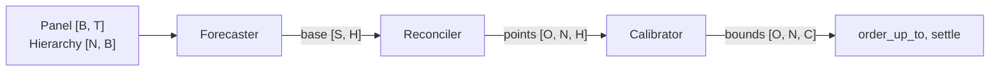

# Calibre

Calibre is a conformal forecasting library for panels of time series. It makes point
forecasts at many origins, reconciles them over a hierarchy, and calibrates bands and
bounds from out-of-sample residuals.

## Quick start

```python
import numpy as np
import pandas as pd

from calibre import Absolute, BottomUp, Hierarchy, LeadTime, Panel, SeasonalNaive, Signed
from calibre import SplitQuantile, Step, replay, rolling_forecasts
from calibre.metrics import coverage

rng = np.random.default_rng(0)
series = np.array(["a", "b", "c"])
periods = pd.date_range("2024-01-01", periods=120, freq="D")
panel = Panel(series, periods, rng.poisson(5.0, (3, 120)), "D")
hierarchy = Hierarchy.from_attributes(
    series, pd.DataFrame({"group": ["x", "x", "y"]}, index=series)
)

origins = np.arange(60, 113)  # each origin is the index of the last observed period
run = rolling_forecasts(panel, hierarchy, SeasonalNaive(7), BottomUp(hierarchy), origins, 7)
actuals = hierarchy.aggregate(panel.values)

calibrator = SplitQuantile(0.9, window=28)
bands = replay(run, actuals, target=Step(), score=Absolute(), calibrator=calibrator)
bound = replay(run, actuals, target=LeadTime(7), score=Signed(), calibrator=calibrator)
print(coverage(bands.target, bands.lower, bands.upper))
```

## Concepts

Shapes use these axes: B bottom series, T periods, N nodes with bottoms first,
S forecast series (B for `BottomUp`, N otherwise), O origins, H forecast steps, and
C target columns (H for `Step`, 1 for `LeadTime`).



| Stage | Names |
|---|---|
| Data | `Panel`, `Hierarchy`, `Covariate` |
| Forecast | `Forecaster`, `Reconciler` (`BottomUp`, `Identity`, `WlsStruct`), `rolling_forecasts` |
| Calibrate | `Target` (`Step`, `LeadTime`), `Score` (`Absolute`, `Signed`), `Loss` (`Miss`, `Newsvendor`), `Calibrator` (`SplitQuantile`, `ACI`, `QuantileTracker`, `MinRisk`, `RiskControl`), `step`, `replay` |
| Decide | `critical_ratio`, `order_up_to`, `settle` |
| Measure | `calibre.metrics`: coverage, width, interval score, pinball, cost |

Two rules hold everywhere. A model reads only its window, so a later value cannot
change a point unless a covariate declares it known ahead. A calibrator sees a score
only once its target is known, and before the origin that knows it issues.

[Architecture](docs/architecture.md) has the shapes and the modules.

## Write a calibrator

A calibrator owns its target, a level or a loss, and is three functions of an explicit
state. `calibre.online` handles the origins, the delays, and the indexing. A new method
is one file in `calibre/conformal/calibrators/`. This is the whole of a quantile tracker:

```python
import numpy as np

from calibre.conformal.calibrators.base import Calibrator


class Tracker(Calibrator):
    def __init__(self, level, lr):
        self.level = level
        self.lr = lr

    def initial_state(self, n_nodes, n_columns):
        return {"q": np.zeros((n_nodes, n_columns))}

    def update(self, state, feedback):
        q = state["q"].copy()
        for row, column in enumerate(feedback.column):  # one row = one origin, one column
            miss = feedback.scores[row] > feedback.issued[row]
            q[:, column] += self.lr * (miss - (1 - self.level))
        return {"q": q}

    def threshold(self, state):
        return state["q"].astype(np.float32)
```

Keep the state in numpy arrays. Then a product can save it after each origin with
`calibre.online.state.flatten` and continue from it.

## Models

| Model | Kind | Install |
|---|---|---|
| `calibre.forecast.models.naive.SeasonalNaive` | local | core |
| `calibre.forecast.models.statsforecast.StatsForecastModel` | local, any `statsforecast.models` model | `calibre[stats]` |
| `calibre.forecast.models.mlforecast.MLForecast` | global regressor with lags and covariates | `calibre[ml]` |
| `calibre.forecast.models.neuralforecast.NeuralForecast` | global network from `neuralforecast.models` | `calibre[neural]` |

```python
from lightgbm import LGBMRegressor
from calibre import BottomUp, Covariate, rolling_forecasts
from calibre.forecast.models.mlforecast import MLForecast

model = MLForecast(
    LGBMRegressor(), lags=[7, 14, 28], features=["price"], fit_periods=365, lookback=84
)
price = Covariate(prices, known_ahead=True, aggregate="mean")  # [B, T + H]
run = rolling_forecasts(
    panel,
    hierarchy,
    model,
    BottomUp(hierarchy),
    origins,
    28,
    refit_every=7,
    covariates={"price": price},
)
```

## Benchmarks

`bench/` is a folder of scripts. They load benchmark data from a directory, run
benchmark protocols, and compare calibrators. They import the installed `calibre`.
Raw data is not in Git.

| Script | Content |
|---|---|
| `vn2.py` | `load(path)`: weekly VN2 sales with the out-of-stock mask, hierarchy, and starting stock. `play(data, bounds)`: six orders up to the bounds, eight settled weeks, holding 0.2 and shortage 1.0 |
| `m5.py` | `load(path)`: daily M5 sales and the 12-level hierarchy (42,840 nodes). `prices(horizon)`: the sell price covariate |
| `compare.py` | `compare(forecasts, actuals, calibrators, target, score, level)`: one row of metrics per method, on the cells where each method was ready |

`vn2_conformal.py` runs the whole VN2 path in about one second:

```sh
uv run python bench/vn2_conformal.py data/vn2
```

## Documents

- [Architecture](docs/architecture.md): modules, array contracts, and costs.
- [Semantics](docs/semantics.md): the calibration rules.

## Development

```sh
uv sync --group dev
uv run pytest
uv run ruff check .
uv run ruff format --check .
uv run ty check src/
uv build --no-sources
```
