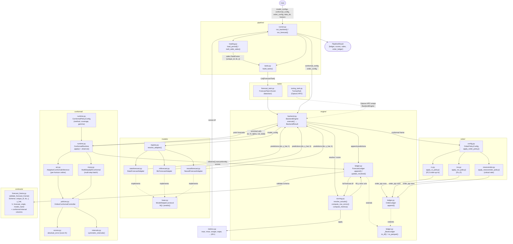

# Calibre Component Orchestration

## Overview

Calibre is a demand planning library. Users call `run_backtest()` or `run_forecast()` from
`pipeline/runner.py`. Forecasts can optionally be wrapped in conformal prediction intervals and
then fed into an order policy (R,S / R,s,S / Newsvendor) to produce order quantities.

## Component Diagram



## Backtest Walk-Forward Loop

For each origin timestamp `BackendEngine.execute()` does:

```
1. _resolve_ledger()         ← fill actuals & observe nonconformity scores from prior round
2. _run_origin()             ← fit adapters on truncated history, predict h steps
3. ConformalRuntime.apply()  ← attach [lo, hi, alpha, calibration_state] per series/model
4. apply_order_policy()      ← derive order_qty from conformal intervals → OrderLedger
5. ForecastLedger.append()   ← validate & store predictions
6. _resolve_ledger()         ← fill actuals that just became known at this origin
```

## Data Flow

| Stage | Input | Output |
|-------|-------|--------|
| **Load** | `data_dir`, `period` | `sales: DataFrame[unique_id, ds, y]` |
| **Build Tasks** | `sales`, `model_configs`, `horizon` | `List[ForecastTask]` |
| **Fit & Predict** | `ForecastTask` (history truncated to origin) | `DataFrame[ds, y_hat, h]` |
| **Conformal** | point forecasts per series/model | adds `y_lo_{cov}`, `y_hi_{cov}`, `conformal_alpha`, `calibration_state` |
| **Order Policy** | conformal frame + inventory params | `order_qty` per series/origin |
| **Validate** | enriched predictions | validated forecast frame |
| **Resolve Actuals** | ledger + sales | fills `y` where `ds ≤ origin` |
| **Observe Scores** | resolved rows + conformal state | updates `nonconformity_score`, adapts `alpha` |
| **Score Errors** | resolved rows | adds `error`, `abs_error`, `pct_error` |
| **Metrics** | scored ledger grouped by `[unique_id, h]` | `mae`, `rmse`, `smape`, `wape` |

## Key Architectural Patterns

- **Adapter + Registry**: `resolve_adapter(model_config)` dynamically instantiates the right backend. New forecasting libraries only need a new adapter + registry entry.
- **Conformal layer**: `ConformalRuntime` is stateful per `(unique_id, model_name)`. ACI updates its alpha each round (online); MSCP uses a rolling calibration window. Both are transparent to the rest of the pipeline.
- **Order layer**: `apply_order_policy()` dispatches to R,S / R,s,S / Newsvendor. All three consume the conformal upper/lower bounds from the forecast frame — orders are decoupled from the forecast model.
- **Dual ledger**: `ForecastLedger` accumulates validated predictions; `OrderLedger` accumulates order decisions. Both extend `_BaseLedger` for unified `to_df()` / `to_parquet()` export.
- **Deferred actuals + observe loop**: Predictions are stored with `y=NaN`. Each origin, newly-matured actuals are filled in and fed back through `ConformalRuntime.observe()` to update calibration state before the next round's `apply()`.
- **Distributed execution**: Fugue partitions `_run_origin` by `unique_id` for parallel processing.
- **HPO via TuningTask**: `TuningTask` wraps `BackendEngine` in an Optuna study, enabling per-series hyperparameter search without touching the core pipeline.
