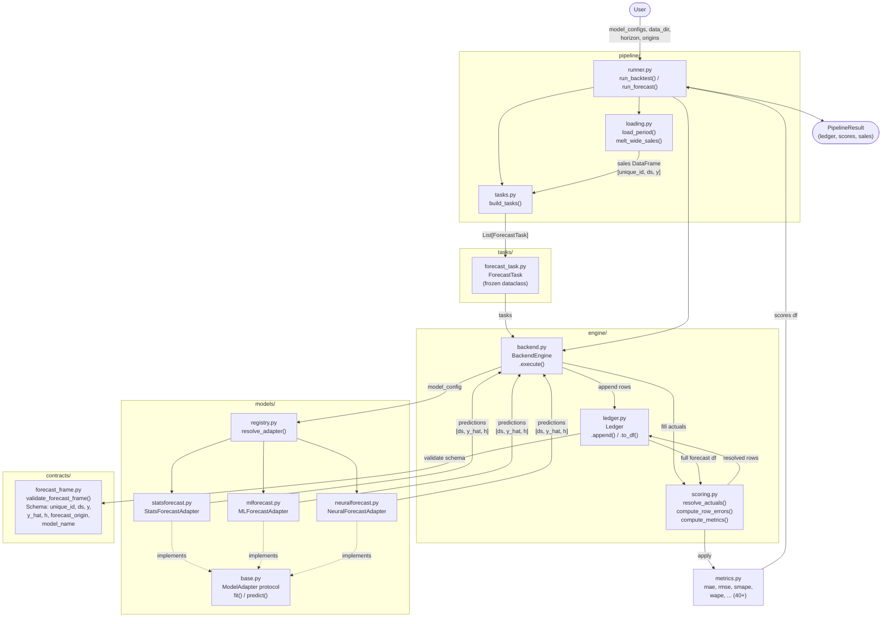

# Calibre Component Orchestration

## Overview

Calibre is a demand planning / forecasting library. Users call `run_backtest()` or `run_forecast()` from `pipeline/runner.py`. Everything else is internal orchestration.

## Component Diagram

## Data Flow

| Stage | Input | Output |
|-------|-------|--------|
| **Load** | `data_dir`, `period` | `sales: DataFrame[unique_id, ds, y]` |
| **Build Tasks** | `sales`, `model_configs`, `horizon` | `List[ForecastTask]` |
| **Fit & Predict** | `ForecastTask` (history truncated to origin) | `predictions: DataFrame[ds, y_hat, h]` |
| **Validate** | predictions + metadata columns | validated forecast frame |
| **Resolve Actuals** | ledger + sales | fills `y` where `ds ≤ origin` |
| **Score** | complete forecast rows | `error`, `abs_error`, `pct_error` |
| **Metrics** | scored ledger grouped by `[unique_id, h]` | `mae`, `rmse`, `smape`, `wape` |

## Key Orchestration Patterns

- **Adapter + Registry**: `resolve_adapter(model_config)` dynamically instantiates the right backend. Adding a new forecasting library requires only a new adapter and registry entry.
- **Backtest loop**: `BackendEngine.execute()` iterates over origins, truncating history at each one to simulate "data available at time T".
- **Contract validation**: Every batch appended to the `Ledger` is validated against the `forecast_frame` schema — errors surface early.
- **Deferred actuals**: Predictions are stored with `y=NaN`; actuals are back-filled once known (origin passes), enabling ongoing evaluation.
- **Distributed execution**: Fugue partitions task execution by `unique_id` for parallel processing.
