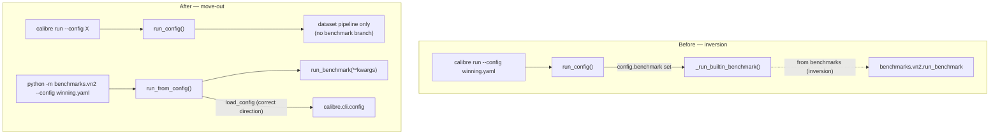

# refactor: Move benchmark run-mode out of the product CLI (closes #86)

## Summary

Remove the last `from benchmarks` import in shipped `calibre/`. The benchmark
run-mode dispatcher (`calibre/cli/commands.py::_run_builtin_benchmark`) leaves
the product CLI entirely and moves into the `benchmarks/vn2/` harness behind its
own entrypoint (`python -m benchmarks.vn2 --config <cfg>`). CI's VN2 winning gate
switches from `calibre run --config winning.yaml` to invoking that entrypoint.

## Problem Frame

Shipped library code reaches *up* into the unshipped `benchmarks/` package.
`benchmarks/` is not part of the wheel (hatchling ships only `calibre/`), so
`calibre/cli/commands.py:117` — `from benchmarks.vn2.run_benchmark import
run_benchmark`, servicing `config.benchmark in {"vn2_winning", "vn2_tuned"}` — is
a dependency inversion that only works in a dev checkout. In a deployed install
(wheel, or the slim image without the benchmark extras) running `calibre run`
with a `benchmark: vn2_winning` config raises `ImportError` at call time.

This is the second and final inversion site. #83 fixed the registry inversion
(`calibre/execution/dataset_registry.py`) by moving the builtin dataset adapters
*into* core — datasets are product surface. Benchmark *runners* are the inverse
case: they are a dev/CI competition harness, not product surface, so the
principled fix points the other way — move the run-mode *out* of the product CLI.
The seam direction was confirmed against the two shapes the issue names.
(see issue #86)

---

## Requirements

**Packaging and layering**

- R1. `grep -rn "from benchmarks" calibre/` (and `import benchmarks`) returns
  nothing across shipped `calibre/`.
- R2. A deployed install running `calibre run` never imports the benchmark
  harness; benchmark run-mode is absent from the product CLI surface (no
  `benchmark` field on the run config, no benchmark dispatch branch).

**Behavior preservation**

- R3. The VN2 winning-config benchmark still runs end-to-end from a dev checkout
  / full image and produces `total_cost=4992.20` on x86_64 Linux — baseline
  untouched (see CLAUDE.md Gotchas).
- R4. The benchmark is invoked through the harness (`python -m benchmarks.vn2
  --config <cfg>`), reproducing the exact `run_benchmark(**kwargs)` mapping the
  CLI previously performed, so the run is bit-for-bit the prior behavior.

**Tests and CI**

- R5. CI's "Smoke test full VN2 benchmark" step invokes the harness entrypoint,
  not `calibre run`.
- R6. An automated guard test fails if any `from benchmarks` / `import
  benchmarks` reappears in `calibre/` (enforces R1 permanently; covers #83 too).

---

## Key Technical Decisions

- **Move-out over registration seam.** Benchmark runners are a dev/CI harness,
  not product surface, so they leave the product CLI rather than being resolved
  through a calibre-side registry. A registry would have to be populated by
  importing `benchmarks/` (re-creating the inversion) or by relocating the VN2
  competition harness into the shipped wheel (bloat) — neither is right. This is
  the inverse of #83, where builtins legitimately belonged in core. (see issue #86)
- **Reuse `run_benchmark(**kwargs)` exactly — not `run_winning`.** The 4992.20
  baseline is produced by `_run_builtin_benchmark` → `run_benchmark(...,
  tune=False)`. The new entrypoint must call the same function with the same
  kwargs. Consolidating the two VN2 entrypoints (`run_benchmark` vs the newer
  `run_winning`) is a separate refactor that would risk drifting the baseline.
- **Entrypoint reads the config via calibre's `load_config`.** `winning.yaml`
  stays the source of truth for execution settings; the entrypoint parses it with
  `calibre.cli.config.load_config` and maps fields to `run_benchmark` kwargs,
  faithfully reproducing the CLI mapping. `benchmarks/` already depends on
  `calibre/` (correct direction), so this adds no new coupling.
- **Drop the `benchmark` field from `BackendConfig`.** The top-level config does
  not set `extra="forbid"` (config.py:160), so a stale `benchmark:` key would be
  silently ignored rather than rejected — but the field and the dispatch branch
  are removed and `winning.yaml` is cleaned so nothing relies on it.
- **Drop the Prometheus order-cost gauge from the benchmark path.** The CLI's
  `_record_order_cost_metric(... dataset=config.benchmark ...)` only mattered when
  `--metrics-port` was set, which benchmark runs never use. `run_benchmark`
  already logs total cost; the entrypoint logs `total_cost` too. The shared
  `_record_order_cost_metric`/`_metric_currency` helpers stay — the normal
  dataset path still uses them.
- **`vn2_tuned` is dropped.** It was a dead allowlist entry: no config references
  it and it produced identical behavior (`tune=False` was hardcoded regardless).
  A real `--tune` path is a deferred follow-up.

---

## High-Level Technical Design

The change removes one directed edge (shipped → unshipped) and relocates the
benchmark entry behind a harness-owned module. `benchmarks/ → calibre/` (already
present and correct) is the only surviving direction.

---

## Scope Boundaries

**In scope:** the single `commands.py:117` import site and the run-mode it
serves; the new harness entrypoint; the CI gate invocation; the `benchmark`
config field; the layering guard test.

### Deferred to Follow-Up Work

- Consolidating `run_benchmark` and `run_winning` into one VN2 entrypoint.
- A real `--tune` / `vn2_tuned` benchmark path.
- Broader cross-package layering enforcement (e.g. import-linter) beyond the
  benchmarks guard.

### Outside this change

- #83's registry inversion (already fixed and shipped).
- The VN2 benchmark math / simulator / HPO internals — untouched.
- The slim/full image split, beyond repointing the one gate step.

---

## Implementation Units

### U1. Add the benchmark harness entrypoint

- Goal: give `benchmarks/vn2/` a config-driven entrypoint that reproduces exactly
  what the CLI's `_run_builtin_benchmark` did, so the benchmark path is live
  before the CLI path is removed.
- Requirements: R4 (and enables R1–R3).
- Dependencies: none.
- Files:
  - `benchmarks/vn2/run_benchmark.py` — add a `run_from_config(config)` helper
    (or a new small `benchmarks/vn2/_runner.py`), keeping `run_benchmark`
    untouched.
  - `benchmarks/vn2/__main__.py` — new; argparse `--config`, calls
    `run_from_config`.
  - `tests/benchmarks/test_vn2_entrypoint.py` — new.
- Approach: `run_from_config` takes a parsed `BackendConfig` and maps it to
  `run_benchmark` kwargs exactly as `_run_builtin_benchmark` does today
  (`dataset.path → data_dir`, `tasks[0].horizon → horizon`, `tune=False`,
  `results_dir=None`, `verbose=True`, and the `execution.*` set:
  `execution_backend`, `ray_address`, `staging_uri`, `ray_threshold`,
  `max_concurrency`, `cpu_per_task`), then writes the summary to
  `output.ledger_path` when set and logs `total_cost`. `__main__.py`: argparse
  `--config` (default `benchmarks/vn2/config/winning.yaml`), `load_dotenv()`,
  `logging.basicConfig(...)`, `load_config(args.config)`, `run_from_config(...)`.
- Patterns to follow: the kwarg mapping and ledger write in
  `calibre/cli/commands.py::_run_builtin_benchmark` (lines 113–134); reuse
  `calibre.cli.config.load_config`; the existing `if __name__ == "__main__"` block
  at the bottom of `run_benchmark.py` for the dotenv/logging setup shape.
- Test scenarios:
  - Happy path: `run_from_config` with a config whose `execution.backend=auto`,
    `ray_threshold=10` maps to the matching `run_benchmark` kwargs — monkeypatch
    `run_benchmark`, assert captured `data_dir`, `horizon`, `tune is False`,
    `execution_backend`, `ray_threshold`, `max_concurrency`, `cpu_per_task`.
  - Edge: an fsspec dataset URI is passed through unchanged — config
    `dataset.path = "memory://calibre-vn2-benchmark/data"`, assert
    `captured["data_dir"] == "memory://calibre-vn2-benchmark/data"` (moved from
    the CLI test being deleted in U2).
  - Edge: ledger is written to `output.ledger_path` when set; not written when
    `None` (monkeypatch `run_benchmark` to return a small summary frame; assert
    parquet exists / absent).
  - Integration: `python -m benchmarks.vn2 --config <tmp cfg>` reaches
    `run_from_config` — invoke the module `main()` with `run_benchmark`
    monkeypatched, assert the summary is returned / ledger written.
- Verification: with VN2 data and the ml/ray extras present,
  `uv run python -m benchmarks.vn2 --config benchmarks/vn2/config/winning.yaml`
  runs to completion; `uv run pytest tests/benchmarks/test_vn2_entrypoint.py`
  passes.

### U2. Remove benchmark dispatch from the product CLI

- Goal: delete the inverted import and the benchmark run-mode from shipped
  `calibre/`.
- Requirements: R1, R2.
- Dependencies: U1 (entrypoint must exist first so the benchmark path is never
  broken between commits).
- Files:
  - `calibre/cli/commands.py` — delete `_run_builtin_benchmark` (lines ~113–134)
    and the `if config.benchmark is not None:` branch in `run_config`
    (lines ~156–172). Keep `_record_order_cost_metric` and `_metric_currency`
    (the normal dataset path still uses them).
  - `calibre/cli/config.py` — remove the `benchmark: str | None = None` field
    (line ~170) from `BackendConfig`.
  - `tests/cli/test_cli.py` — update `test_winning_config_uses_auto_backend`
    (drop the `config.benchmark == "vn2_winning"` assertion; keep
    backend/scope/ray_threshold); delete `test_builtin_benchmark_preserves_
    fsspec_dataset_uri` (its coverage moves to U1).
- Approach: pure deletion plus the field removal; no behavior change to the
  dataset run path. After this, `calibre run` only does real dataset runs.
- Test scenarios:
  - `test_winning_config_uses_auto_backend` still loads `winning.yaml` and
    asserts `execution.backend == "auto"`, `tasks[0].config["scope"] ==
    "global"`, `execution.ray_threshold == 10` (no benchmark assertion).
  - Existing normal-path tests (`test_run_command_executes_config`,
    `run_config` dataset tests) still pass unchanged — no regression to the
    BackendEngine path.
  - Static: `grep -rn "from benchmarks" calibre/` returns nothing.
- Verification: `uv run pytest tests/cli` passes; `uv run ruff check .` and
  `uv run ty check calibre/` are clean; the grep invariant holds.

### U3. Repoint the CI gate and clean the harness config

- Goal: CI invokes the harness entrypoint; `winning.yaml` drops the dead
  `benchmark` selector.
- Requirements: R3, R5.
- Dependencies: U1, U2.
- Files:
  - `.github/workflows/ci.yml` — the "Smoke test full VN2 benchmark" step
    (line ~103).
  - `benchmarks/vn2/config/winning.yaml` — remove `benchmark: vn2_winning`
    (line 2).
- Approach: change the step to run the harness in the full image, e.g.
  `docker run --rm -v "$PWD/data/vn2:/app/data/vn2:ro" --entrypoint python
  calibre:full -m benchmarks.vn2 --config /app/benchmarks/vn2/config/winning.yaml`
  (the image ENTRYPOINT is `calibre`, so override with `--entrypoint python`;
  `-m benchmarks.vn2` resolves because `/app` is the workdir and `benchmarks/` is
  COPYed in with the ml/ray extras installed — the `mlflow` import is already
  optional, exactly as today). Drop the `benchmark:` line from `winning.yaml`.
- Test scenarios: Test expectation: none — CI workflow + config edit, validated
  by the CI run itself. The gate must still produce `total_cost=4992.20`
  (x86_64/Linux).
- Verification: the "Smoke test full VN2 benchmark" job passes via the new
  entrypoint and the baseline 4992.20 is unchanged; the slim-image smoke step
  (smoke.yaml, no benchmark) is unaffected.

### U4. Add the layering guard test

- Goal: enforce the no-`from benchmarks`-in-`calibre/` invariant permanently so
  neither #86 nor #83 can silently regress.
- Requirements: R6.
- Dependencies: U2.
- Files: `tests/test_package_layering.py` — new. This is a cross-cutting
  architecture test with no single module to mirror, so it sits at the tests
  root rather than under a module-mirroring subdirectory.
- Approach: walk every `*.py` under `calibre/`, parse it with `ast`, and assert
  no `Import`/`ImportFrom` node targets the `benchmarks` top-level package.
- Test scenarios:
  - Happy path: the assertion passes against the current tree (after U2).
  - Regression intent: the test fails loudly if a `from benchmarks ...` import is
    reintroduced anywhere in `calibre/` (the assertion message names the
    offending file and line).
- Verification: `uv run pytest tests/test_package_layering.py` passes.

---

## Risks & Dependencies

- **Baseline drift (R3).** The only safe reproduction is calling
  `run_benchmark(**kwargs)` with the same kwargs the CLI used. Do not route the
  entrypoint through `run_winning` or alter execution defaults. Verify 4992.20 is
  unchanged in the CI full-image job before merge.
- **Full-image import chain.** `python -m benchmarks.vn2` relies on the same
  `benchmarks → calibre` import chain the CLI dispatch already exercised in
  `calibre:full` (including the optional `mlflow` import in
  `benchmarks/common/tracking.py`). Because the chain is unchanged and only the
  trigger moves, full-image parity holds; the slim image never runs this path.
- **Commit ordering.** U1 before U2 so the benchmark path is never broken
  mid-sequence; U3 lands with or after U2 so CI is repointed exactly when the CLI
  path disappears.

## Sources / Research

- `calibre/cli/commands.py:113-172` — `_run_builtin_benchmark` and the
  `run_config` benchmark branch being removed (the kwarg mapping U1 reproduces).
- `calibre/cli/config.py:160-171` — `BackendConfig`; top-level config has no
  `extra="forbid"`, and the `benchmark` field is removed here.
- `calibre/execution/dataset_registry.py` — #83's resolution pattern (builtins
  moved *into* core); this change is its inverse for runners.
- `benchmarks/vn2/run_benchmark.py` — `run_benchmark` signature + existing
  `__main__` block; already imports `calibre.*` (correct direction).
- `.github/workflows/ci.yml:103` — the VN2 winning gate invoked through
  `calibre run`; `Dockerfile`/`Dockerfile.slim` both COPY `benchmarks/` in.
- `tests/cli/test_cli.py:246-291` — the two CLI benchmark tests updated/moved.
- CLAUDE.md Gotchas — the 4992.20 baseline and its x86_64-vs-arm64 divergence.
