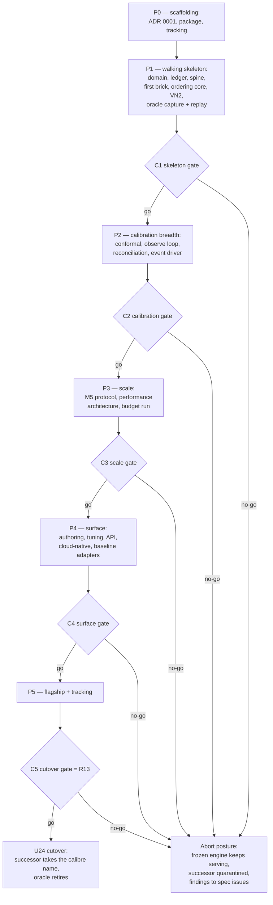

# feat: Stage 3 successor build plan — greenfield engine to spec

## Summary

Build the greenfield successor engine as an in-tree, dependency-isolated
package (`newcalibre/`) to the public spec at `docs/spec/`: an ungated
scaffolding phase, then five completion-gated phases — walking skeleton (VN2
end-to-end on the new spine), calibration breadth, M5 scale and performance,
service surface, then flagship measurement and cutover. The frozen engine
serves as behavior oracle at tag `oracle-freeze-2026-07-06` throughout and
retires at cutover.

---

## Problem Frame

Stage 3 of the rewrite program is entered. The freeze is in force (the frozen
engine's final gate state is the #280 merge), the architecture spec is landed
and public (`docs/spec/`, #297), the test-suite curation ruling and oracle
contract are ratified (#290), and the Stage 3 entry decisions are ratified
(#293, 2026-07-08). What does not yet exist is the build order: a
dependency-ordered, checkpoint-gated plan for the rebuild itself. This plan is
that artifact — the #294 deliverable. It carries the cutover gate under the
pinned environment, the oracle harness per the ratified equivalence contract,
protocol reproduction from the spec's protocol chapters, cost-regression
tracking that treats frozen-engine totals as reference points only, the
abort/checkpoint criterion for a weeks-scale rebuild, and the
first-contributor landing surface.

---

## Program bindings

Public-record facts this plan builds under. The entry decisions are restated
here because this plan is their first durable public record.

- **Freeze ruling** (milestone description, in force since the #280 merge):
  old-engine feature development is stopped for the program's duration.
  Reference-maintenance carve-out only; any carve-out merge touching engine
  code paths or dependencies re-runs the runbook M5 checks or re-mints the
  reference artifacts.
- **Oracle reference**: tag `oracle-freeze-2026-07-06` (commit `686a1b2`),
  `uv.lock` sha256 recorded in the tag message. Stage 3 consults the oracle at
  the pinned tag, never `HEAD` (chapter 50's one-immutable-tag rule).
- **Equivalence contract** (#290, ratified): the curation ruling — 179
  items classified, ~110 canonical oracle properties, the tolerance doctrine,
  checkpoint portability rulings, and CI gate tiers. `docs/spec/50-test-and-oracle-strategy.md`
  states the doctrine; the per-item corpus sits behind
  `[ANNEX:50-oracle-curation-record]`.
- **Entry decisions** (#293, ratified 2026-07-08):
  1. **Repo strategy**: in-tree top-level package in this repository; the
     spec stays at `docs/spec/` and remains the sole requirements source.
  2. **#279** (Linux ca-subset coverage-neutrality baseline): not minted;
     stays parked. The advisory neutrality gate keeps skipping.
  3. **Environment pin**: cutover numbers and the performance bar bind to a
     workstation-class x86_64 Linux reference environment, recorded as a spec
     ADR (U1 below) — resolving chapter 30's pending decision.
  4. **Flagship run**: commits to this repository.
- **VN2 tripwire**: the frozen engine's `total_cost=4992.20` regression gate
  (x86_64 Linux) stays green for the program's duration. It is apparatus of
  the frozen engine — never a successor target, never a comparison baseline
  (`[VN2-N1]`).
- **Leak review**: every landing that touches `docs/spec/`
  carries an owner leak-review stamp on its tracking issue before it lands,
  batched per landing. This plan's own commit is such a point, stamped on
  #294.

---

## Requirements

Plan-local R-IDs. Spec requirement tags (`[VIS-*]`, `[PRF-*]`, `[VN2-*]`,
`[M5-*]`, `[SEAM-*]`, `[FLG-*]`, chapter conformance items) are cited where
they carry the detail, so this plan never re-states spec content it would
then have to keep in sync.

**Build shape**

- R1. The successor is an in-tree top-level package `newcalibre/` with its
  own `pyproject.toml` and `uv.lock`; the frozen engine's root project files,
  test estate, and CI gates remain untouched until cutover, with two
  pre-authorized config-only exceptions, both executed in U2 as
  reference-maintenance carve-outs (no engine code path, tripwire re-run
  recorded): a trigger filter on the frozen workflow (`paths-ignore` for
  `newcalibre/**` and `docs/**`) so successor PRs do not run the frozen
  pipeline, and a root-ruff exclude for `newcalibre/` so the frozen lint
  job never evaluates successor code under the frozen toolchain.
- R2. The spec at `docs/spec/` is the sole design source. Frozen-engine code
  is consulted as behavior oracle only, at the pinned tag, through
  manifest-complete captures (chapter 50). No successor module is ported from
  old code.
- R3. Progress is completion-gated: after the ungated scaffolding phase,
  five build phases, each closed by a named go/no-go checkpoint (C1–C5) with
  recorded owner review. No calendar gates. An abort at any checkpoint
  leaves the frozen engine as the shipped system.

**Fidelity and testing**

- R4. The successor's test estate implements the chapter 50 CI tier
  structure (tiers 0–4). Tier 1 (oracle properties on synthetic fixtures) is
  the center of gravity: carried properties restated behaviorally with named
  tolerance classes and in-source derivations. No assertion compares
  successor floats to frozen-engine outputs at any tolerance.
- R5. Cross-engine end-to-end checking is conditional replay: the frozen
  engine's VN2 decision stream captured at the pinned tag with a complete
  capture manifest, replayed through the successor's settlement, matched
  against a trajectory independently recomputed from the shared inputs
  (tolerance class 2 — summation rounding only).
- R6. Every numeric gate the successor mints ships its witness test (the
  smallest meaningful drift fails the gate) in the same tier.
- R7. The four same-engine exactness templates pass on the successor:
  resumed == uninterrupted, distributed == sequential,
  serialized == never-serialized, same seed == same bytes.

**Numbers on the pinned environment**

- R8. A full-M5 backtest completes within the chapter 30 budget on the
  reference environment: ≤ 15 min wall (`[PRF-1]`), ≤ 60 s pre-origin
  (`[PRF-2]`), within 32 GB (`[PRF-20]`), with the standard profile
  deliverables (`[PRF-30]`–`[PRF-33]`) produced by the harness invocation
  itself.
- R9. Protocol conformance: VN2 replication outputs per
  `[VN2-R1]`–`[VN2-R5]`, and an M5 acceptance run reaching a PASS verdict
  under derived bands, the completeness floor, and the sales-coverage label
  (`[M5-A*]`, `[M5-X*]`).
- R10. The flagship two-axis claim (chapter 42) is measured on VN2: a
  pre-registered acceptance band (`[FLG-3]`), a guarantee-on configuration
  minted fresh on the successor, a reference configuration re-tuned
  engine-fresh (`[FLG-5]`), published together with the per-round trajectory,
  committed to this repository.
- R11. Cost-regression tracking exists for the successor's own minted totals
  (VN2 triple, flagship ratio, full-M5 wall clock), appended per measurement
  run with environment manifests. Frozen-engine totals appear once, as
  labeled reference points — never targets, never denominators (`[VN2-N1]`,
  `[VN2-N2]`).

**Contributor path**

- R12. The seasonal-naive first brick is implementable from chapters 02 + 04
  alone and green in under a day; chapter 60's walkthrough is its acceptance
  test. A public first-brick backlog (follow-on adapters and methods) exists
  as tracked issues once C1 passes.

**Cutover**

- R13. The cutover gate is three-part, all green on the pinned environment:
  (a) **fidelity** — tiers 1–3 green, including conditional replay and the
  ruled-divergence check (chapter 50 acceptance criteria 1–8);
  (b) **numbers** — R8, R9, and R10 with the certificate inside its
  pre-registered band. A certificate outside the band is a C5 no-go routing
  to owner review; the price ratio is recorded evidence and never gates
  (chapter 42's tracked-not-gated discipline);
  (c) **completeness** — every `[VIS-1]`–`[VIS-11]` acceptance criterion
  demonstrated by test or scripted walkthrough; the C5 review walks the
  chapter 01 register row by row.
- R14. Cutover mechanics: the successor package takes the `calibre` name;
  the frozen engine, its tests, and its apparatus (including the 4992.20
  tripwire) are deleted, not loosened; tier-3 oracle gates are deleted with
  the oracle; captures are archived as historical artifacts.

**Program mechanics**

- R15. Stage 3 tracking exists on GitHub: a successor milestone whose issues
  are minted from this plan's units, with checkpoint reviews recorded
  publicly. Landings touching `docs/spec/` carry the leak-review stamp per
  the program bindings.

---

## Key Technical Decisions

- **KTD1 — Isolated in-tree uv project.** `newcalibre/` carries its own
  `pyproject.toml` + `uv.lock` and is not a uv workspace member of the root
  project. Rationale: the frozen engine's lockfile is pinned by the oracle
  tag and guarded by the VN2 tripwire; successor dependency churn must not
  touch either. One repo keeps spec, oracle, and successor in a single
  review surface (entry decision 1).
- **KTD2 — Working name `newcalibre`.** Package directory and import name
  are `newcalibre` until cutover, when the package takes the `calibre` name
  (R14). Rationale: collision-free coexistence with the frozen package; the
  spec's own "New-Calibre" phrasing.
- **KTD3 — Walking skeleton first.** The build walks the full spine
  (domain → engine core over in-memory ports → seasonal-naive → ordering
  core → VN2 protocol) before any breadth. Rationale: the abort criterion
  needs the earliest possible end-to-end signal, and conditional replay
  de-risks settlement arithmetic — the surface where a greenfield engine is
  most likely to silently diverge — at the first checkpoint.
- **KTD4 — Reference environment pinned by ADR.** A workstation-class
  x86_64 Linux profile (hardware class, OS, Python/BLAS versions, thread
  policy), recorded as `docs/spec/adr/0001-reference-environment.md` (entry
  decision 3). All cutover numbers are minted there. The chapter 30 budget
  is assessed plausible on workstation class; pinning it makes `[PRF-1]`
  binding rather than aspirational.
- **KTD5 — Oracle discipline.** Only tier 3 touches frozen-engine outputs;
  every capture ships the chapter 50 manifest (tag, platform, lockfile
  digest, config digest, input-data digest); captures are taken from a
  checkout of the pinned tag, never from `main`.
- **KTD6 — Checkpoints as completion gates with abort-to-frozen-engine.**
  Each phase ends in a recorded go/no-go. Abort posture: the frozen engine
  keeps serving; the partial successor stays quarantined in `newcalibre/`
  (never half-cutover); findings route to spec tracking issues. Every abort
  additionally triggers a recorded owner disposition choosing between
  lifting the freeze (old-engine work resumes as the shipped system) and
  amending the spec for a named Stage 3 re-entry precondition — including
  the quarantined package's retention or deletion — so the abort branch has
  a next move, not an indefinite freeze. A recurring owner heartbeat
  (roughly every four weeks of wall time, non-gating) records phase
  progress and elapsed freeze cost on the tracking issue and may invoke the
  mandatory stall review; a checkpoint stalled without a credible path
  forward always triggers that review rather than silent drift.
- **KTD7 — Conformance-first testing.** Each unit's test scenarios are the
  owning spec chapter's conformance items plus the #290-carried oracle
  properties for that surface, written as failing tests before
  implementation. The spec is the requirements document; this plan
  deliberately does not restate its content.

---

## High-Level Technical Design

The engine's component architecture is owned by the spec (chapters 02–12);
this plan adds no design and draws none of it. The build-order shape — an
ungated scaffolding phase plus five gated phases, five gates, one abort
posture — is the only structure this plan owns:



Checkpoint criteria (each also requires tiers 0–2 green for everything built
so far, and an owner review recorded on the tracking issue):

| Gate | Proves | Go criteria |
|---|---|---|
| C1 | The spine and settlement arithmetic are sound end-to-end | VN2 runs end-to-end on the skeleton; conditional replay matches the recomputed trajectory to summation rounding; chapter 03 acceptance 1, 3, 7, 8, 9; the instantiable class-4 templates green (same seed == same bytes, resumed == uninterrupted) — the serialization and distribution templates are recorded as pending U10/U16, re-checked at C2/C3, never claimed vacuously; first brick green from chapters 02+04 alone |
| C2 | The calibration stack honors the seam contract | Chapter 05 protocol suite green for the three `[CNF-24]` method families; every bound carries a descriptor; observe loop restart-safe; two-driver equivalence green (chapter 03 acceptance 2 and 6); reconciliation reference agreement; third-party sequential-adaptive parity green; the advisory flagship dry-run recorded (below) |
| C3 | The performance architecture closes the gap at retail scale | Full-M5 within the chapter 30 budget on the reference environment; M5 acceptance PASS; resolve+commit cost flat across origins; distributed == sequential template green |
| C4 | The engine is usable, tunable, and servable | Chapter 10 onboarding script green; tuning study ranks by in-loop realized cost; API/time-loop driver equivalence; kill-and-resume loses nothing; the `[REG-4]` baseline adapter set green against the shared conformance suite |
| C5 | Cutover is authorized | R13 in full |

---

## Output Structure

Expected shape of the successor package (scope declaration, not a
constraint; per-unit file lists are authoritative):

```
newcalibre/
├── pyproject.toml            # own project; own lockfile (KTD1)
├── uv.lock
├── README.md                 # points readers at docs/spec/
├── src/newcalibre/
│   ├── domain/               # ch 02 — types, frame, task, descriptor, cost
│   ├── ledger/               # ch 02 — row families, predicates, attribution
│   ├── engine/               # ch 03 — spine, ports, drivers, settle hook
│   ├── forecasting/          # ch 04 — protocol, registry, adapters/
│   ├── conformal/            # ch 05 — runtime seam, methods/, manifests
│   ├── observe/              # ch 06 — resolution, pending buffer, cadence
│   ├── reconcile/            # ch 07 — protocol, registry, summing matrix
│   ├── ordering/             # ch 08 — cost mapping, policies, simulator
│   ├── tuning/               # ch 09 — candidate, objective, fan-out
│   ├── authoring/            # ch 10 — config schema, validate, compose
│   ├── api/                  # ch 11 — verbs, jobs, sessions
│   ├── storage/              # ch 12 — stores, migrations
│   └── protocols/            # ch 20/21 — vn2/, m5/ adapters + scoring
├── benchmarks/               # measurement runs, tracking series, flagship
├── scripts/                  # successor-owned dataset acquisition
└── tests/
    ├── tier1/                # oracle properties (synthetic fixtures)
    ├── tier2/                # self-consistency templates
    ├── tier3/                # oracle captures, conditional replay, ruled divergence (deleted at cutover)
    ├── tier4/                # protocol acceptance at scale + third-party reference parity (permanent)
    └── fixtures/
```

---

## Implementation Units

Units are PR-scale work orders; Stage 3 tracking (R15) mints them as issues.
Each cites its owning spec chapters; test scenarios are the cited chapter's
conformance items plus the named extras. Units within a phase may proceed in
parallel once their dependencies are met.

### Phase P0 — Scaffolding

### U1. Reference-environment ADR

- **Goal**: Resolve chapter 30's pending reference-environment decision as
  ratified in entry decision 3.
- **Requirements**: R8 grounding; KTD4.
- **Dependencies**: none.
- **Files**: `docs/spec/adr/0001-reference-environment.md`,
  `docs/spec/adr/README.md` (index row),
  `docs/spec/30-performance.md` (replace the PENDING DECISION paragraph with
  a pointer to the ADR).
- **Approach**: ADR per the `docs/spec/adr/README.md` template. Decision:
  the budget and all cutover numbers bind to a named workstation-class
  x86_64 Linux profile — record hardware class (cores/RAM), OS, Python
  minor, BLAS provenance, and thread policy as the pin. State the
  consequence: `[PRF-1]`'s 15-minute bar binds to this class; laptop-class
  feasibility is explicitly not claimed.
- **Test scenarios**: none — documentation unit. Leak review is the gate:
  owner stamp on #294 recorded before this landing (it edits `docs/spec/`).
- **Verification**: ADR indexed; chapter 30 no longer carries a pending
  decision; leak-review stamp recorded.

### U2. Successor package scaffold and Stage 3 tracking

- **Goal**: Stand up `newcalibre/` as an isolated uv project with tier-0 CI,
  and mint the Stage 3 milestone + issues.
- **Requirements**: R1, R15; KTD1, KTD2.
- **Dependencies**: none.
- **Files**: `newcalibre/pyproject.toml`, `newcalibre/uv.lock`,
  `newcalibre/README.md`, `newcalibre/src/newcalibre/__init__.py`,
  `.github/workflows/newcalibre-ci.yml`.
- **Approach**: Own project (KTD1), Python ≥ 3.12, initial dependencies
  minimal (numpy, pandas, pyarrow, pydantic, pyyaml; Nixtla enters with
  U25, Ray with U16). Ruff + ty configured package-locally, mirroring the
  repo's docstring gate. New CI workflow path-filtered to `newcalibre/**`
  (lint, format check, type check, pytest) with least-privilege
  `permissions: contents: read` and no secrets. Apply R1's pre-authorized
  carve-out in the same landing: `paths-ignore` for `newcalibre/**` +
  `docs/**` on the frozen workflow's triggers, and a root-ruff exclude for
  `newcalibre/` (the root lint job runs `ruff check .` and would otherwise
  evaluate successor code under the frozen toolchain) — config-only edits,
  no engine code path, tripwire re-run recorded. Tier markers
  (`tier1`–`tier4`) declared from day one; tiers 3–4 scheduled/manual, not
  per-commit (chapter 50 cadence). Mint the Stage 3 milestone with one
  issue per implementation unit (U3 onward), each carrying its checkpoint
  assignment.
- **Test scenarios**: a placeholder tier-1 test proves the CI wheel turns
  (collection, markers, coverage of the empty package); a successor-only
  PR is shown to trigger only the successor workflow (frozen jobs
  path-filtered away), and a frozen-path PR still runs the frozen pipeline
  unchanged.
- **Verification**: `uv sync && uv run pytest` green inside `newcalibre/`;
  root `uv.lock` diff empty; the carve-out edits and tripwire re-run
  recorded on the tracking issue; milestone populated.

### Phase P1 — Walking skeleton (→ C1)

### U3. Domain core

- **Goal**: Chapter 02's data vocabulary as typed code: series/panel,
  forecast frame, forecast task, origin/horizon, cost structure, guarantee
  descriptor.
- **Requirements**: R2, R4; chapter 02 `[SER-*]`, `[PAN-*]`, `[FRA-*]`,
  `[TSK-*]`, `[CST-*]`, `[GRT-*]`, `[INV-TEMPORAL]`.
- **Dependencies**: U2.
- **Files**: `newcalibre/src/newcalibre/domain/` (panel, frame, task, cost,
  descriptor, validation), `newcalibre/tests/tier1/test_domain_frame.py`,
  `newcalibre/tests/tier1/test_domain_task.py`,
  `newcalibre/tests/tier1/test_domain_descriptor.py`.
- **Approach**: Frame schema validation as a hard boundary (`[FRA-3]`: no
  partially valid frame). Temporal hygiene enforced at task construction
  (`[TSK-2]`), not inside models — the spec names this as a deliberate
  reversal of the frozen engine's placement. Descriptor as a closed
  vocabulary (`[GRT-2]`); censoring facts as status + optional availability
  bound (`[PAN-3]`).
- **Execution note**: conformance-first — chapter 02 conformance items 1, 2,
  6 as failing tests before implementation.
- **Test scenarios**: chapter 02 conformance 1 (schema rejection per missing/
  mistyped column), 2 (property test: no history timestamp ≥ origin reaches
  a model), 6 (session-identity purity — deferred part to U20 where sessions
  materialize); fixture-arithmetic cases for frame row-key uniqueness and
  target-timestamp derivation (`[FRA-1]`); descriptor vocabulary closure
  (unregistrable claim/currency rejected).
- **Verification**: tier-1 suite green; #290-carried frame/task properties
  covered per the corpus.

### U4. Ledger and scoring predicates

- **Goal**: The ledger as the single scoring surface: three row families,
  one-shot monotone resolution, per-type scored-row predicate registry,
  unscored attribution.
- **Requirements**: R2, R4; chapter 02 `[LED-1]`–`[LED-8]`, `[ORD-1]`–`[ORD-3]`.
- **Dependencies**: U3.
- **Files**: `newcalibre/src/newcalibre/ledger/`,
  `newcalibre/tests/tier1/test_ledger_lifecycle.py`,
  `newcalibre/tests/tier1/test_ledger_predicates.py`.
- **Approach**: Append-only issuance, pending → resolved exactly once,
  never backward (`[LED-2]`). One shared predicate registry keyed by
  descriptor type (`[LED-8]`) consumed by every metric surface — never
  re-derived. Readiness/finiteness persisted per issued row so unscored mass
  is always attributable (`[LED-7]`).
- **Execution note**: conformance-first.
- **Test scenarios**: chapter 02 conformance 4 (single shared predicate) and
  5 (every unscored row attributed in a completed run); monotone-resolution
  property (second resolution attempt rejected; no column degraded);
  denominator discipline (`[LED-5]`: pending/unscored never in coverage
  denominators; unscored counts reported alongside); #290-carried coverage
  denominator-taxonomy kernels.
- **Verification**: tier-1 green; predicate registry is the only coverage
  code path.

### U5. Engine spine, ports, time-loop driver, settle hook

- **Goal**: Chapter 03's runtime: the six-phase per-origin cycle over
  abstract ports, the time-loop driver, the settle hook with the drain
  guard, and the determinism contract.
- **Requirements**: R2, R4, R7; chapter 03 `[ENG-*]`, `[SPN-*]`, `[DRV-2]`,
  `[STA-1]`, `[STA-3]`, `[DET-*]`, `[SET-*]`.
- **Dependencies**: U3, U4.
- **Files**: `newcalibre/src/newcalibre/engine/` (spine, ports, timeloop,
  settle), `newcalibre/tests/tier1/test_spine.py`,
  `newcalibre/tests/tier1/test_settle.py`,
  `newcalibre/tests/tier2/test_selfconsistency.py`.
- **Approach**: Orchestration is I/O-free (`[ENG-3]`): panel source, actuals
  source, artifact store, calibration-state store, ledger sink, dispatch
  backend as ports; the whole cycle must run on in-memory implementations.
  Unconfigured stages are identities (`[ENG-4]`). Resolve before Predict;
  Commit persists exactly once (`[SPN-4]`); committed origins skip on resume
  (`[SPN-5]`). Settle hook: arrival law, exactly-once cost booking,
  configured stock-out transition rule, drain of L zero-order periods with
  the missing-history construction failure (`[SET-4]`), decision cadence
  from the review period (`[SET-7]`). Seeded determinism and explicit thread
  budgets (`[DET-5]`–`[DET-6]`).
- **Execution note**: conformance-first; the class-4 self-consistency
  templates (R7) are the unit's spine tests, minted here and re-run at every
  later checkpoint.
- **Test scenarios**: chapter 03 acceptance 1 (no-op composition
  byte-identity), 3 (kill-after-origin-k resume equals uninterrupted; no
  re-booked (series, period)), 7 (arrival-law property: order at `t` first
  serves `t + L`; each period's cost booked exactly once), 8 (drain guard
  construction failure naming the shortfall), 9 (port isolation: full cycle
  with no filesystem/network/database access); same-seed bitwise
  reproducibility on one platform (`[DET-6]`).
- **Verification**: tiers 1–2 green; acceptance 2 and 6 explicitly deferred
  to U14 (event driver), 4 and 5 to U16 (dispatch), and 10 (the substrate
  audit) to U25 with U16's dispatch-port half — no silent coverage claim.

### U6. Forecasting plugin protocol and the seasonal-naive first brick

- **Goal**: Chapter 04's adapter protocol, registry, and the chapter 60
  first brick — the contributor landing surface.
- **Requirements**: R2, R4, R12; chapter 04 `[ADA-*]`, `[REG-*]`, `[SCO-*]`,
  `[ART-*]`, `[FIT-*]`, `[CEN-*]`; chapter 60.
- **Dependencies**: U3.
- **Files**: `newcalibre/src/newcalibre/forecasting/` (protocol, registry,
  `adapters/seasonal_naive.py`),
  `newcalibre/tests/tier1/test_adapter_protocol.py`,
  `newcalibre/tests/tier1/test_seasonal_naive.py`.
- **Approach**: Protocol first: construct-from-config, `fit`/`predict`,
  one row per (series key, horizon step), registry under explicit backend
  identifiers, scope-blind adapters (`[SCO-2]`), loud failure on missing
  capability or unfit predict (`[ADA-5]`/`[ADA-6]`), fitted-values sidecar
  (`[FRA-5]`), censoring-aware fit as a declared input contract (`[CEN-*]` —
  the #290-carried fit-target kernel). The seasonal-naive adapter itself is
  written exactly to the chapter 60 walkthrough — it is the acceptance test
  for spec standalone-readability, so it must not consume anything outside
  chapters 02 + 04.
- **Test scenarios**: chapter 60's first test verbatim (season-lagged lookup
  against a hand-checkable `m = 7` fixture, frame schema green); lifecycle
  guard (`predict` before `fit` raises); short-history and missing-period
  loud failure; adapter conformance suite run against every registered
  adapter (`[VIS-2]` acceptance); registry rejects duplicate identifiers.
- **Verification**: tier-1 green; the brick's implementation consulted no
  old-repo path and no annex pointer (review checklist item).

### U7. Ordering core: policies and inventory simulation

- **Goal**: Chapter 08's decision layer: cost-pair mapping, order-policy
  protocol, newsvendor / order-up-to (R,S) / gated (R,s,S) mechanics,
  integer units, and the inventory simulator realizing the settle contract.
- **Requirements**: R2, R4; chapter 08 `[CFG-*]`, `[POL-*]`, `[OBJ-*]`,
  `[SIM-*]`; chapter 41 `[SEAM-4]`.
- **Dependencies**: U3, U5.
- **Files**: `newcalibre/src/newcalibre/ordering/` (cost mapping, policies,
  simulator), `newcalibre/tests/tier1/test_policies.py`,
  `newcalibre/tests/tier1/test_simulation.py`.
- **Approach**: Policy protocol: calibrated forecast + inventory position +
  cost structure → orders; refusal contracts carried from the #290 corpus
  (undefined critical ratio, missing bound columns → reject, never guess).
  The simulator is the time-loop realization of `[SET-*]`; conservation and
  linear cost breakdown are its oracle properties. Cost attaches at decision
  nodes only (`[SEAM-4]`).
- **Execution note**: conformance-first; policy arithmetic is
  fixture-arithmetic (hand-derivable exact assertions, tolerance class 1/2).
- **Test scenarios**: newsvendor critical-ratio arithmetic on hand-derived
  fixtures; order-up-to and gated order-up-to step semantics (the #290 ORD
  kernels); ceil-then-clamp integer units; inventory conservation across a
  multi-period fixture; linear holding/shortage breakdown row-exactness;
  refusal on unformable critical ratio (`[CST-2]`).
- **Verification**: tier-1 green; chapter 08 conformance covered.

### U8. VN2 protocol harness

- **Goal**: Chapter 20 as runnable configuration: dataset adapter, reveal
  validation, the two-slot pipeline dynamics, cost accounting, and the
  replication outputs.
- **Requirements**: R2, R9; chapter 20 `[VN2-0]`, `[VN2-D*]`, `[VN2-C*]`,
  `[VN2-S*]`, `[VN2-K*]`, `[VN2-R*]`.
- **Dependencies**: U5, U6, U7.
- **Files**: `newcalibre/src/newcalibre/protocols/vn2/` (adapter, replay,
  scoring), `newcalibre/benchmarks/vn2/` (configs),
  `newcalibre/scripts/download_vn2_data.py` (successor-owned acquisition,
  recording per-file digests per `[VN2-D0]`),
  `newcalibre/tests/tier1/test_vn2_protocol.py`,
  `newcalibre/tests/tier4/test_vn2_acceptance.py`; CI cache wiring for the
  scheduled tiers in `.github/workflows/newcalibre-ci.yml`.
- **Approach**: Protocol as data (`[VN2-0]`): rounds, lead time, review
  period, cost rates enter as configuration. Reveal validation rejects
  anything but exactly-one-appended-column (`[VN2-D2]`). Initial state
  seeding from the given on-hand + two in-transit slots (`[VN2-D7]`). The
  run produces the order stream, the cost ledger, and the final triple; a
  measurement run adds per-round cumulative cost and the protection-window
  coverage measurement with its censoring-aware companion when in-stock data
  is present (`[VN2-R5]`). The skeleton acceptance run orders from the
  point forecast via order-up-to with a descriptor claim of
  `none (not engine-calibrated)` — no conformal method exists until U10,
  which is valid under `[VN2-R5]`'s conditionality (a run without a
  calibrated bound owes the cost trajectory only). Data acquisition is
  successor-owned from day one so no tier depends on frozen `benchmarks/`
  tooling that cutover deletes.
- **Test scenarios**: chapter 20 conformance 1–6 verbatim (reveal
  validation, hand-checkable weekly transition incl. seeded rounds,
  arrival-law timing, no-future-leak property, row-exact cost identities and
  triple-equals-ledger-sums, constants-as-config); the #290-carried
  reveal-anchor kernel (round r sees reveals 0..r−1 only).
- **Verification**: tier 1 green; a full 8-week run on the challenge data
  produces all three artifacts and validates row-exactly (tier 4, scheduled).

### U9. Oracle capture and the conditional-replay harness

- **Goal**: The cross-engine equivalence mechanism: manifest-complete
  captures from the frozen engine at the pinned tag, the tier-3
  conditional-replay gate, and the ruled-divergence check.
- **Requirements**: R5, R6; chapter 50 (capture manifest, conditional
  replay, ruled-divergence acceptance 5, witness discipline); KTD5.
- **Dependencies**: U8.
- **Files**: `newcalibre/tests/tier3/captures/vn2/` (decision stream +
  `manifest.json`), `newcalibre/tests/tier3/captures/censoring/`
  (demand-scored synthetic-censoring fixture run + manifest),
  `newcalibre/tests/tier3/test_conditional_replay.py`,
  `newcalibre/tests/tier3/test_ruled_divergence.py`,
  `newcalibre/scripts/capture_oracle_vn2.py` (capture runner; reads a
  pinned-tag checkout, writes captures + manifest).
- **Approach**: Capture the frozen engine's VN2 order stream (599 series × 6
  rounds) by running the winning-loop configuration at
  `oracle-freeze-2026-07-06` in a detached worktree of the tag, synced
  `--frozen` in its own venv; the runner computes the lockfile sha256 from
  the file it actually synced and hard-fails on mismatch with the tag
  message, so the manifest records the measured environment, never a copied
  claim. Manifest fields per chapter 50: tag, platform triple, lockfile
  digest, config digest, input-data digests. The replay test first verifies
  the digests of the inputs it consumes against the manifest, then feeds
  the captured stream plus revealed actuals to the successor's settlement
  and compares against a trajectory recomputed independently from the same
  inputs through the chapter 20 cost identities — never against the frozen
  engine's stored ledger. Tolerance class 2. A second capture runs the
  frozen engine on a synthetic censored-demand fixture, and the
  ruled-divergence test asserts the successor *diverges* from it under
  demand scoring (chapter 50 acceptance 5 — the fix-is-working check).
  This realizes the #290 BEN-3 ruling; the frozen engine's 4992.20 scalar
  is never asserted.
- **Execution note**: capture before build — the captures land with their
  manifests first, so the replay and divergence tests are written against
  fixed artifacts.
- **Test scenarios**: replay matches recomputed trajectory to summation
  rounding per round and at the terminal point; witness — perturbing one
  order by one unit in one round fails the gate; manifest completeness —
  the test refuses a capture missing any manifest field; input integrity —
  the test recomputes input digests and refuses to run on mismatch with
  the manifest; ruled divergence — the successor's demand-scored result
  differs from the frozen capture on the censoring-ruled surface, and
  agreement fails the test; tier gating — tier 3 skips (visibly, with
  cause) when captures are absent rather than green-washing.
- **Verification**: tier 3 green against the committed captures on the
  reference environment; witness proven to bite.

**Checkpoint C1 — skeleton gate.** Criteria in the gate table. Recorded
go/no-go on the tracking issue; on go, mint the first-brick backlog issues
(R12) since the contributor surface is now real — each backlog issue
discloses the pending cutover rename (KTD2) so contributors aren't
surprised by the repository-wide move.

### Phase P2 — Calibration breadth (→ C2)

### U10. Conformal runtime seam and the split-conformal family

- **Goal**: Chapter 05's stable runtime interface: method lifecycle,
  per-partition state, manifests (assumptions, readiness, `joint_claim`),
  descriptor issuance, config parity, clamps as claim-voiding opt-ins.
- **Requirements**: R2, R4; chapter 05 `[CNF-*]`; chapter 41 `[SEAM-1]`,
  `[SEAM-6]`–`[SEAM-9]`; chapter 02 `[CAL-1]`–`[CAL-4]`.
- **Dependencies**: U3, U4, U5.
- **Files**: `newcalibre/src/newcalibre/conformal/` (runtime, state,
  registry, `methods/split.py`),
  `newcalibre/tests/tier1/test_conformal_runtime.py`,
  `newcalibre/tests/tier1/test_split_conformal.py`,
  `newcalibre/tests/tier2/test_state_roundtrip.py`.
- **Approach**: One runtime seam, methods behind a registry with declared
  assumptions and readiness rules (`[CAL-4]`); state keyed by
  (session, partition) and unconditionally round-trippable (`[CAL-2]`,
  `[STA-2]` — the spec makes restorability method-family-unconditional, a
  deliberate reversal of the frozen engine). Every bound issued with a
  populated descriptor (`[SEAM-1]`); clamps rewrite the claim to
  `none (not engine-calibrated)` on exactly the modified rows (`[SEAM-8]`).
  The unweighted split-conformal branch is the first family — it is the
  exchangeability-carrying branch the flagship's guarantee-on configuration
  requires (chapter 42).
- **Execution note**: conformance-first; the #290-carried calibration
  kernels (readiness gating, window accounting, warmup) are tier-1
  properties here.
- **Test scenarios**: chapter 41 conformance 1 (descriptor mandatory;
  unregistered claim rejected), 4 (registry rejects bad `joint_claim` and
  class-conditional without context), 6 (clamp rewrites descriptors
  per-row); split-conformal finite-sample quantile-rank arithmetic on
  fixtures (class 1/2); readiness: no finite bound before the declared
  requirement, attribution of warm-up rows (`[LED-6]`); serialized ==
  never-serialized bit-identity of subsequent bounds (class 4).
- **Verification**: tiers 1–2 green; protocol suite parameterized to run
  against every registered method from here on.

### U11. Observe loop and online recalibration

- **Goal**: Chapter 06's runtime/state contract: actuals resolution into
  calibration state, pending buffering, restart safety, cold-start
  liveness, cadence.
- **Requirements**: R2, R4, R7; chapter 06 `[OBS-*]`; chapter 03 `[SET-5]`.
- **Dependencies**: U10.
- **Files**: `newcalibre/src/newcalibre/observe/`,
  `newcalibre/tests/tier1/test_observe.py`,
  `newcalibre/tests/tier2/test_observe_restart.py`.
- **Approach**: The observe verb resolves due rows before prediction (spine
  order fixed in U5); aggregates gate on completeness (all-members-present,
  `[INV-COHERENCE]`); late/out-of-order actuals buffer as pending
  observations; single-observation discipline (`[SET-5]`) rejected at
  construction when a config would double-observe.
- **Test scenarios**: in-order vs out-of-order actuals with interleaved
  restarts yield identical calibration state and resolved ledgers (`[VIS-10]`
  acceptance, class 4); aggregate resolution waits for the last member;
  double-observe config rejected at construction; cold-start: a fresh
  session emits (attributed) infinite/absent bounds, never a fabricated
  finite one.
- **Verification**: tiers 1–2 green.

### U12. Reconciliation stage

- **Goal**: Chapter 07: reconciler protocol, strategy registry,
  summing-matrix construction from hierarchy facts, sparse-first
  representation, points-only output contract.
- **Requirements**: R2, R4; chapter 07 `[REC-*]`; chapter 41 `[SEAM-2]`,
  `[SEAM-3]`; `[PRF-21]`.
- **Dependencies**: U3, U5.
- **Files**: `newcalibre/src/newcalibre/reconcile/` (protocol, registry,
  summing, strategies), `newcalibre/tests/tier1/test_reconcile.py`,
  `newcalibre/tests/tier1/test_summing_matrix.py`.
- **Approach**: Strategy as configuration behind a registry (bottom-up,
  structural-weights, and a MinT-family entry); sparse summing matrix as
  the default at scale with the dense path threshold-gated (`[PRF-21]`);
  stage input contract rejects frames carrying interval/quantile columns
  (`[SEAM-2]`); idempotence and numerical-honesty properties per chapter 07.
- **Execution note**: conformance-first against the closed-form dense
  reference (tolerance class 3: solver tolerance + conditioning bound,
  re-derived — the #290-carried reconciliation mathematics).
- **Test scenarios**: node-count identity and exact member sums on a fixture
  lattice; closed-form MinT agreement within the derived bound;
  cross-section isolation (one series' change cannot move an unrelated
  cross-section); interval-column rejection; two-origin fixture proves
  previously issued bounds untouched (chapter 41 conformance 2); coherence
  of reconciled points (`[REC-12]`).
- **Verification**: tier-1 green; both sparse and dense paths tested and
  agreeing within the derived tolerance.

### U13. Weighted and sequential-adaptive families, third-party parity gate

- **Goal**: The remaining two `[CNF-24]` day-one method families — weighted
  (reweighted scores with finite-sample correction) and sequential-adaptive
  (ACI-style) — plus the reference-implementation gate anchoring the
  sequential family to a published third-party trace.
- **Requirements**: R2, R4, R6; chapter 05 `[CNF-24]`; chapter 50
  (tolerance class 3; the carried RUN-3 gate pattern).
- **Dependencies**: U10, U11.
- **Files**: `newcalibre/src/newcalibre/conformal/methods/weighted.py`,
  `newcalibre/src/newcalibre/conformal/methods/sequential.py`,
  `newcalibre/tests/tier1/test_weighted.py`,
  `newcalibre/tests/tier1/test_sequential_adaptive.py`,
  `newcalibre/tests/tier4/reference/aci/` (pinned third-party trace +
  parity test — housed in the permanent scheduled tier, not tier 3, because
  its oracle is engine-independent and the gate survives cutover).
- **Approach**: Each method declares its assumption set and readiness rule
  in the manifest; per-horizon-step partitions are the M5 configuration
  shape. The parity gate translates the published reference's contract,
  replays its trace at a pinned commit, and diagnoses first divergence.
  The committed trace lives under `newcalibre/` so it does not depend on
  frozen-tree artifacts that cutover deletes.
- **Test scenarios**: step-level agreement with the published trace within
  the reference's declared tolerance; first-divergence diagnostic names
  step and quantity; weighted-family finite-sample correction on
  hand-derived fixtures (class 1/2); manifests declare assumptions and
  readiness; protocol suite green for both new families (including state
  round-trip).
- **Verification**: tiers 1 and 4 green; three `[CNF-24]` families
  registered.

### U14. Event driver and two-driver equivalence

- **Goal**: Chapter 03's second driver: engine verbs as externally driven
  events, out-of-order tolerant, observationally equivalent to the
  time-loop driver.
- **Requirements**: R2, R4, R7; chapter 03 `[DRV-1]`–`[DRV-3]`, `[STA-2]`.
- **Dependencies**: U5, U10, U11.
- **Files**: `newcalibre/src/newcalibre/engine/event_driver.py`,
  `newcalibre/tests/tier2/test_driver_equivalence.py`.
- **Approach**: The event driver composes the same closed verb surface
  (`[DRV-2]`) — no HTTP yet (chapter 11 projects it later); events name
  their session; the time-loop driver is the in-order special case of the
  same buffering mechanism (`[DRV-3]`).
- **Test scenarios**: chapter 03 acceptance 2 (same inputs and actuals
  stream through both drivers → identical ledger rows and orders) and 6
  (session warmed by time-loop, continued by event driver, for every
  registered conformal method); out-of-order event delivery converges to
  the in-order result.
- **Verification**: tier-2 green across both registered method families.

**Checkpoint C2 — calibration gate.** Criteria in the gate table. The C2
review additionally records an **advisory flagship dry-run**: the
guarantee-on configuration shape (chapter 42) run on VN2 with the split
family, reporting coverage-versus-band shape and a rough cost read —
explicitly labeled advisory and never certified (`[FLG-3]` binds certified
runs only). This gives the program its earliest reading on the headline
claim three phases before U22, instead of discovering a structurally
miscalibrated guarantee-on configuration after the two most expensive
phases are paid for.

### Phase P3 — Scale (→ C3)

### U15. M5 protocol harness and acceptance scorer

- **Goal**: Chapter 21 as runnable configuration: data contract, marginal
  lattice, readiness-inequality validation, acceptance scoring with derived
  bands and the sales-coverage label.
- **Requirements**: R2, R9; chapter 21 `[M5-0]`, `[M5-D*]`, `[M5-H*]`,
  `[M5-B*]`, `[M5-A*]`, `[M5-X*]`, `[M5-R1]`.
- **Dependencies**: U12, U13.
- **Files**: `newcalibre/src/newcalibre/protocols/m5/` (adapter, lattice,
  scorer), `newcalibre/benchmarks/m5/` (configs),
  `newcalibre/scripts/download_m5_data.py` (successor-owned acquisition
  with per-file digests, mirroring U8's VN2 script),
  `newcalibre/tests/tier1/test_m5_protocol.py`,
  `newcalibre/tests/tier4/test_m5_acceptance.py`.
- **Approach**: Positional day-label derivation with the contiguity guard;
  the marginal lattice with level-recoverable node labels (`[M5-H4]`);
  origin-window readiness validation at configuration time (`[M5-B3]`,
  recomputed from the method's declared rule — never the copied 64/28/10);
  the scorer re-derives bands from sampling variance at the run's actual
  scored-row counts with an effective-sample-size correction (`[M5-A4]`),
  verdict logic with undetermined-never-passes, machine-readable summary
  carrying the sales-coverage label and the declared reconciler (`[M5-R1]`).
- **Test scenarios**: chapter 21 conformance 1–7 verbatim (data validation,
  lattice identity and collision rejection, readiness-inequality rejection,
  count-carrying coverage quantities via the shared predicate, verdict
  property tests, label enforcement as a test failure, constants-as-config).
- **Verification**: tier-1 green; a reduced-slice acceptance run produces
  the full artifact set (summary, per-node table, report).

### U16. Performance architecture

- **Goal**: The chapter 30 architectural requirements built into the
  engine: incremental actuals/ledger indexing, staging reuse, the
  incremental-fit path, vectorized calibration-state updates, and
  parallelism along the permitted axes.
- **Requirements**: R2, R8 grounding; `[PRF-10]`–`[PRF-14]`,
  `[PRF-22]`–`[PRF-23]`, `[PRF-30]`–`[PRF-33]`; chapter 03 `[DET-3]`–`[DET-5]`.
- **Dependencies**: U5, U11; touches U6 (adapter update path) and U10
  (state batching).
- **Files**: `newcalibre/src/newcalibre/engine/` (indexing, staging,
  dispatch), `newcalibre/src/newcalibre/forecasting/` (update-path protocol
  extension), `newcalibre/src/newcalibre/conformal/` (vectorized state
  apply), `newcalibre/tests/tier1/test_incremental_indexing.py`,
  `newcalibre/tests/tier2/test_dispatch_invariance.py`,
  `newcalibre/benchmarks/profile/` (deliverable schema + harness hooks).
- **Approach**: Each requirement names the baseline cost it deletes
  (chapter 30): per-origin resolve/commit becomes O(newly admissible +
  newly resolved) via due-date indexing; task histories become views over
  one staged panel; plugins may declare `update` distinct from `fit` and
  the engine uses it when declared; calibration state applies batch-wise
  over the partition axis; Ray enters behind the dispatch port with
  series/task parallelism inside an origin and state-bearing sequences
  never reordered (`[PRF-14]`). Profile deliverables emitted by the harness
  itself (`[PRF-30]`–`[PRF-33]`), streaming ledger I/O (`[PRF-22]`), peak
  RSS captured per stage (`[PRF-23]` — the gap the baseline profile named).
- **Test scenarios**: resolve+commit flat-cost property across a growing
  synthetic ledger (the shape of chapter 30 acceptance 2, at test scale);
  trivial-model per-origin fit cost near zero via the update path
  (acceptance 3, at test scale); batch-placement invariance and
  serial/parallel ledger byte-identity (chapter 03 acceptance 4–5) under
  the Ray backend; profile artifact contains every `[PRF-30]`–`[PRF-32]`
  field and reconciles ≥ 99% of wall clock.
- **Verification**: tiers 1–2 green including the dispatch-invariance
  suite; scaling curve produced at 1k/10k series on CI-class hardware.

### U17. Full-M5 budget run on the reference environment

- **Goal**: R8 demonstrated: the full-M5 workload within budget on the
  pinned environment, profile deliverables attached.
- **Requirements**: R8; `[PRF-1]`, `[PRF-2]`, `[PRF-20]`, `[PRF-3]`;
  chapter 30 acceptance 1–4.
- **Dependencies**: U15, U16; U1 (the environment pin).
- **Files**: `newcalibre/benchmarks/m5/` (full config),
  `newcalibre/benchmarks/results/m5-budget/` (committed profile artifact +
  environment manifest).
- **Approach**: Owner-executed on the ADR-pinned workstation profile; the
  same harness invocation emits the benchmark result and the profile
  artifact (never hand-assembled). If the budget is missed, C3 fails: the
  gap analysis (which `[PRF-1x]` requirement under-delivered) routes to
  either targeted engine work or an owner-ratified ADR amendment — never a
  silent bar move.
- **Test scenarios**: none beyond the run itself — the committed artifact
  is the evidence; a tier-4 check validates artifact completeness and the
  ≥ 99% wall-clock reconciliation.
- **Verification**: wall ≤ 15 min, pre-origin ≤ 60 s, peak RSS ≤ 32 GB on
  the pinned environment; artifact committed with manifest.

**Checkpoint C3 — scale gate.** Criteria in the gate table. This is the
program's riskiest bet (the ~5× gap); a no-go here is the most likely abort
path and is why the perf architecture precedes the service surface.

### Phase P4 — Service surface (→ C4)

### U18. Pipeline authoring

- **Goal**: Chapter 10: config-as-data mapping 1:1 onto domain objects,
  `validate` as a first-class verb, sane defaults, sweep and tuning-run
  composition.
- **Requirements**: R2; chapter 10 `[AUT-*]`, `[VAL-*]`, `[CMP-*]`;
  `[VIS-7]`.
- **Dependencies**: U3–U13 (it is their user-facing projection).
- **Files**: `newcalibre/src/newcalibre/authoring/`,
  `newcalibre/tests/tier1/test_authoring.py`,
  `newcalibre/tests/tier1/test_validate.py`.
- **Approach**: Declarative blocks (dataset adapter, model, reconciler,
  conformal method, cost structure, policy, tuning) mapping 1:1 onto
  chapter 02 objects; validation catches contract violations before
  execution (including the M5 readiness inequality and the drain guard —
  both construction-time failures by spec); null expressible and distinct
  from omitted (the #290-carried config lesson).
- **Test scenarios**: chapter 10 conformance; the onboarding acceptance
  script — a new user authors and validates a runnable backtest from docs
  alone (`[VIS-7]` acceptance, scripted); validation failures name the
  violated contract; defaults produce a runnable minimal config.
- **Verification**: tier-1 green; onboarding script green in CI.

### U19. Tuning

- **Goal**: Chapter 09: the three-channel candidate object, realized cost
  as the symbolically bound default objective, local/global study scope,
  Ray fan-out with resume, and reference-tuning mode.
- **Requirements**: R2, R10 grounding; chapter 09 `[TUN-*]`; `[VIS-4]`,
  `[VIS-8]`; chapter 42 `[FLG-5]`.
- **Dependencies**: U16, U18.
- **Files**: `newcalibre/src/newcalibre/tuning/`,
  `newcalibre/tests/tier1/test_tuning.py`,
  `newcalibre/tests/tier2/test_study_resume.py`.
- **Approach**: A candidate spans model, conformal, and ordering channels
  as one object; the objective binds to "the chapter 08 objective"
  symbolically; decision numbers are never tunable (the guard is a
  construction-time rejection); reference-tuning mode (`[TUN-24]`) produces
  labeled, never-certified bounds — the flagship's denominator lane.
- **Test scenarios**: a study ranks candidates by in-loop realized cost
  with no post-hoc scoring (`[VIS-4]` acceptance, small fixture); tuning a
  forbidden decision number is rejected at construction; local vs global
  scope flip is config-only and both pass the same protocol tests
  (`[VIS-8]` acceptance); partial-completion resume reproduces the
  uninterrupted study's surviving trials (class 4).
- **Verification**: tiers 1–2 green.

### U20. API surface

- **Goal**: Chapter 11: lifecycle verbs as thin projections, async job
  semantics, deterministic session identity, tenancy keying, server-owned
  artifacts, what-if overrides.
- **Requirements**: R2; chapter 11 `[API-*]`, `[JOB-*]`; chapter 02
  `[SES-*]`; `[VIS-6]`.
- **Dependencies**: U14, U18.
- **Files**: `newcalibre/src/newcalibre/api/`,
  `newcalibre/tests/tier1/test_api_projection.py`,
  `newcalibre/tests/tier2/test_api_driver_equivalence.py`.
- **Approach**: Every route composes the closed verb surface; no API-only
  logic (`[DRV-2]`); session identity is the chapter 02 pure function
  (chapter 02 conformance 6 lands here); clients never supply model bytes
  or artifact URIs (`[STA-4]`).
- **Test scenarios**: for every lifecycle verb, an API call and a
  driver-invoked call with the same defining inputs address the same
  session and append identical ledger rows (`[VIS-6]` acceptance); job
  lifecycle (submit → poll → result) with failure surfacing; cross-tenant
  addressing returns the same response as absent state — no existence
  oracle (chapter 11 conformance 6, `[API-5]`); a data-plane reference
  whose scheme is outside the configured allowlist is rejected as a client
  error before any engine work (`[API-7]`); what-if override leaves
  durable state untouched.
- **Verification**: tiers 1–2 green.

### U21. Cloud-native state and stores

- **Goal**: Chapter 12: the three durable state classes behind the U5
  ports — relational run metadata and calibration state, object-store
  artifacts — plus migration discipline, health/readiness/metrics, and the
  restart invariants.
- **Requirements**: R2, R7; chapter 12 `[TOP-*]`, `[DUR-*]`, `[RST-*]`,
  `[MIG-*]`, `[MON-*]`; `[VIS-5]`.
- **Dependencies**: U5, U20.
- **Files**: `newcalibre/src/newcalibre/storage/` (stores, migrations),
  `newcalibre/tests/tier2/test_restart_invariants.py`,
  `newcalibre/tests/tier1/test_stores.py`.
- **Approach**: Store implementations of the ports U5 defined (the engine
  core never learns about Postgres or object stores); every durable fact in
  a store, never process memory (`[STA-1]`); migrations forward-only with
  parity checks; the kill-a-replica test is the `[VIS-5]` acceptance.
- **Test scenarios**: kill any single worker mid-run and restart — the run
  resumes and its ledger resolves identically (`[VIS-5]` acceptance, class
  4); calibration-state store round-trip bit-identity under the real
  backend; the ORM-model-vs-migration-head diff is empty in CI (`[MIG-2]`)
  and a replica booted against a stale schema reports not-ready and
  receives no traffic (`[MIG-5]`, `[MON-2]`); health/ready endpoints
  reflect store reachability.
- **Verification**: tiers 1–2 green against a real Postgres service in CI
  (pattern exists in the frozen CI: a `postgres` service container).

### U25. Baseline Nixtla adapter set

- **Goal**: The `[REG-4]` baseline adapter families — classical-statistical,
  gradient-boosted ML (dotted-path estimator selection, native quantiles via
  per-level objectives), and neural — wrapping the Nixtla libraries behind
  the U6 protocol, plus the substrate audit.
- **Requirements**: R2, R13(c) grounding (`[VIS-1]`, `[VIS-2]`); chapter 04
  `[REG-4]`, `[ADA-*]`, `[ART-*]`; chapter 03 acceptance 10.
- **Dependencies**: U6, U16 (update-path protocol extension).
- **Files**: `newcalibre/src/newcalibre/forecasting/adapters/statistical.py`,
  `newcalibre/src/newcalibre/forecasting/adapters/ml.py`,
  `newcalibre/src/newcalibre/forecasting/adapters/neural.py`,
  `newcalibre/tests/tier1/test_baseline_adapters.py`,
  `newcalibre/tests/tier1/test_substrate_audit.py`.
- **Approach**: One adapter class per family; model choice within a library
  is configuration (`[REG-4]`). Artifacts persist through each library's
  native persistence API (`[STA-4]`); fitted-values sidecar and native
  quantile emission where the library supplies them; update-path declared
  where the library supports incremental fit (`[PRF-12]`). The seasonal-naive
  brick stays library-free by chapter 60 design; this unit is what makes
  the `[VIS-1]` audit satisfiable ("every bundled forecasting plugin
  implemented against Nixtla interfaces" — the audit scopes to the
  Nixtla-wrapping baseline set, with the chapter 60 brick documented as the
  spec's own library-free exception).
- **Test scenarios**: shared adapter conformance suite green against every
  registered adapter (`[VIS-2]` acceptance); artifact round-trip through
  each native persistence API restores predict behavior; substrate audit —
  the engine core's dependency graph reaches Ray only through the dispatch
  port and every baseline adapter imports only Nixtla interfaces
  (chapter 03 acceptance 10, completing U16's dispatch-port half);
  determinism per `[ADA-2]` on a fixed seed for each family.
- **Verification**: tier-1 green; `[VIS-1]`/`[VIS-2]` demonstrable at C4.

**Checkpoint C4 — surface gate.** Criteria in the gate table.

### Phase P5 — Flagship and cutover (→ C5)

### U22. Flagship measurement apparatus and run

- **Goal**: Chapter 42 realized: pre-registration, the guarantee-on
  configuration, certificate computation with eligibility enforcement, the
  engine-fresh reference tuning, and the two-axis publication.
- **Requirements**: R10; chapter 42 `[FLG-1]`–`[FLG-5]`; chapter 20
  `[VN2-R4]`–`[VN2-R5]`.
- **Dependencies**: U8, U10, U19; U1 (environment); C4 passed.
- **Files**: `newcalibre/benchmarks/vn2/flagship/` (pre-registration file,
  guarantee-on config, publication artifact),
  `newcalibre/src/newcalibre/protocols/vn2/certificate.py`,
  `newcalibre/tests/tier1/test_certificate.py`.
- **Approach**: Strictly ordered: (1) commit the pre-registration (interval
  type, confidence level, declared post-warmup pooling window) before any
  certified run (`[FLG-3]`); (2) mint the guarantee-on configuration fresh —
  coverage target at the critical ratio in every decision slot, no clamps,
  the unweighted split branch (chapter 42's configuration contract); (3)
  re-tune the reference configuration on the successor in reference mode
  (`[FLG-5]`, via U19); (4) run both on the pinned environment, publish
  certificate + price ratio + per-round trajectory together. The
  stockout-window revisit checkpoint from chapter 42 is carried as a
  declared open item in the publication, not silently dropped.
- **Test scenarios**: chapter 42 conformance 1–3 (eligibility rejection on
  wrong claim/level/label/clamp; pooled number computed over exactly the
  pre-registered window with the trajectory alongside; both totals from the
  same settle-path accounting differing only in configuration); witness —
  a clamped-bound run is refused certification.
- **Verification**: publication artifact committed with environment
  manifest; certificate within the pre-registered band, or the miss
  published as-is and C5 records a no-go — the publication's gate is
  honesty; the cutover decision is R13(b)'s.

### U23. Cost-regression tracking

- **Goal**: R11: run-over-run tracking of the successor's own minted
  totals, with frozen-engine totals as labeled reference points only.
- **Requirements**: R6, R11; `[VN2-N1]`–`[VN2-N2]`.
- **Dependencies**: U8, U17, U22.
- **Files**: `newcalibre/benchmarks/tracking/series.json` (append-only run
  records: totals + environment manifest + config digest + input-data
  digests), `newcalibre/benchmarks/tracking/README.md`,
  `newcalibre/tests/tier4/test_tracking_discipline.py`.
- **Approach**: Every measurement run appends one record: VN2 triple,
  flagship ratio, full-M5 wall clock, the (config, toolchain, architecture)
  comparability triple (`[VN2-N2]`), and the `[VN2-D0]` input-file digest
  inventory — datasets are re-downloaded, so a drifted input must break
  comparability rather than masquerade as a cost regression.
  Frozen-engine totals (the 4992.20 triple and the profiled 74.7-minute
  baseline) appear once in the README as labeled reference points with
  their environments — the wording states they are not targets. Regression
  alerting compares successor runs to successor runs under a matching
  triple and matching input digests only.
- **Test scenarios**: discipline test — a tracking record missing any
  manifest field (including input digests) is rejected; comparisons across
  mismatched triples or mismatched input digests refuse to produce a
  delta; witness — a synthetic cost jump on a matching triple flags.
- **Verification**: tier-4 check green; first three real records present
  (VN2 acceptance, M5 budget run, flagship).

### U24. Cutover

- **Goal**: R14 executed once C5 is green and owner-ratified.
- **Requirements**: R13 (gate), R14 (mechanics).
- **Dependencies**: C5.
- **Files**: repository-wide — the successor package moves to `calibre`;
  `calibre/` (frozen), `tests/`, `benchmarks/` (frozen apparatus),
  root `pyproject.toml`/`uv.lock`, `Dockerfile`/`Dockerfile.slim`,
  `.github/workflows/ci.yml`, `README.md`, `CLAUDE.md`, `docs/agents/`
  updated; `newcalibre/tests/tier3/` deleted; captures archived.
- **Approach**: One landing, owner-driven, in this order: verify C5 record;
  tag the pre-cutover state on `main` as the rollback anchor and record the
  revert criterion (a named post-merge defect class — broken CI, broken
  Docker entrypoint, broken onboarding script — triggers a single revert to
  the anchor); announce a merge-freeze window for in-flight `newcalibre/`
  PRs and include an import/path mapping note in the cutover PR (KTD2's
  rename breaks contributor branches otherwise); move `newcalibre/` to the
  `calibre` name and promote its pyproject/lock to the root; delete the
  frozen engine, its tests, and its apparatus (tripwires retired, not
  loosened — `[VN2-N1]`); delete tier 3 with the oracle (the third-party
  parity gate already lives in tier 4 and survives) and archive captures as
  historical artifacts under `docs/`, with a pointer left at the flagship
  publication's pre-move path; retarget Docker and CI at the successor and
  re-point branch-protection required checks at the successor workflow's
  job names in the same change window (deleted required checks otherwise
  block every subsequent merge); update the docs' entry points. The oracle
  tag remains in git history as the permanent reference.
- **Test scenarios**: post-cutover CI green on tiers 0–2 and scheduled
  tier 4; a repo-wide check finds no remaining assertion pinned to a
  frozen-engine measured number; no successor test references a deleted
  frozen-tree path; the onboarding script still green under the new name.
- **Verification**: cutover landing merged; successor CI is the repo's CI
  with required checks re-pointed; R14 checklist recorded on the tracking
  issue.

---

## Risks & Dependencies

- **The performance bet (highest risk).** The chapter 30 budget demands ~5×
  over the baseline architecture and is only assessed plausible on
  workstation class. Mitigations: the perf architecture is its own unit
  (U16) sequenced before the service surface; C3 is a hard gate with an
  explicit no-go path (targeted `[PRF-1x]` gap analysis or an owner-ratified
  ADR amendment — never a silent bar move).
- **Cross-architecture float divergence.** Measured ~0.4% end-to-end spread
  across CPU architectures poisons any naive cross-engine or cross-machine
  numeric comparison. Mitigations are structural: the tolerance doctrine
  (no cross-engine float equality, class-6 floors), manifest-complete
  captures, and the ADR-pinned environment for every headline number.
- **Spec defects discovered while building.** The spec is authoritative;
  divergence discovered mid-build routes to a tracking issue and a
  leak-reviewed spec amendment — the build never silently diverges from a
  chapter. Chapter 60's standalone-readability claim gets a checklist-level
  check at U6 (no old-repo path, no annex pointer consulted), but the
  builder is also the spec's author, so the real acceptance for
  standalone-readability is the first externally contributed backlog brick
  after C1 — record it as such on the R12 backlog.
- **Freeze erosion.** Long Stage 3 duration invites "just one small
  old-engine change". The freeze ruling and carve-out govern; anything
  touching frozen code paths re-runs the runbook checks or re-mints
  reference artifacts (program bindings). Mechanical erosion is covered
  too: GitHub runner-image migrations or action deprecations can redden
  the frozen CI (the tripwire is sensitive to the numeric stack) with zero
  repo changes — runner/action pinning edits to the frozen workflow are
  pre-authorized as reference-maintenance carve-outs, each recorded with a
  tripwire re-run.
- **Single-maintainer bandwidth.** The checkpoint cadence (R3) and the
  first-brick backlog (R12) are the levers: gates prevent silent drift,
  and the contributor path offloads adapter/method breadth after C1.
- **Upstream dependencies.** Nixtla libraries (chapter 04 substrate), Ray
  (dispatch), the public VN2/M5 datasets (download-scripted, never
  committed), and the published third-party trace for U13 at its pinned
  commit.

---

## Scope Boundaries

**In scope**: everything above — the successor engine to spec, its test
estate, the protocol harnesses, the flagship apparatus, tracking, cutover.

**Deferred to follow-up work**

- Production deployment (clusters, Helm charts, managed Postgres, object
  stores): chapter 12's conformance surface is in scope; provisioning real
  infrastructure is post-cutover work.
- The demo track (#92–#94): parked by the program dispositions for
  post-cutover retarget.
- First-brick backlog execution: the backlog is minted at C1 (R12);
  individual bricks are contributor work items, not units of this plan.
- A censoring-indicated dataset binding beyond VN2/M5 (chapter 21 `[M5-X5]`
  names the revisit condition; chapter 42's stockout-window checkpoint is
  carried in the flagship publication).

**Non-goals**

- Bug-for-bug fidelity with the frozen engine (chapter 50 refuses it; the
  equivalence harness expects divergence on ruled-defect surfaces).
- Porting frozen-engine code, constants, tolerances, or baselines into the
  successor (the non-carry rules; extraction of ruled kernels via the #290
  corpus is the only carry path).
- Old-engine feature work of any kind (freeze ruling; #279 stays parked per
  entry decision 2).
- New headline claims beyond the chapter 42 flagship (chapter 01's
  flagship discipline; the spec's no-positioning rule).

---

## Documentation & Operational Notes

- **This landing** carries the plan alone. Its commit is a leak-review
  point per the #294 contract (owner rules the plan text public-safe; stamp
  recorded on #294 before merge). U1's ADR landing touches `docs/spec/` and
  carries its own batched stamp when it lands.
- **#293 backfill**: the entry decisions were ratified in-session and are
  recorded in this plan's Program bindings; the owner may backfill #293
  with the same public-safe wording for issue-local traceability.
- **#294 closure**: merging this plan's landing with the leak-review stamp
  and owner ratification satisfies the #294 deliverable contract;
  `closes #294` on the landing PR.
- **Stage 3 tracking**: U2 mints the successor milestone and unit issues;
  checkpoint reviews are recorded there (R15). The Moat-first rewrite
  milestone closes with #294.

---

## Sources & Research

- Spec: `docs/spec/00-overview.md` (map, prefix registry),
  `01-vision-and-commitments.md` (the completeness register R13(c) verifies),
  `02-domain-model.md`, `03-engine-core.md`, `30-performance.md` (baseline,
  budget, pending decision U1 resolves), `40-gated-seams/41…/42…`
  (seam + flagship bindings), `50-test-and-oracle-strategy.md` (tiers,
  doctrine, conditional replay), `60-onboarding.md` (first brick),
  `20-protocol-vn2.md` / `21-protocol-m5.md` (protocol facts, non-carry
  rules).
- Program record: milestone description (freeze ruling, dispositions,
  tripwire), tag `oracle-freeze-2026-07-06` (oracle pin + lockfile digest),
  #290 (curation ruling memo: taxonomy, tolerance doctrine, checkpoint
  portability, runbook-gate rulings), #293/#294 (entry decisions mandate,
  successor-plan deliverable contract), #283 (program tracking shape).
- Frozen-engine surfaces consulted as provenance only: `pyproject.toml` and
  `.github/workflows/ci.yml` (coexistence constraints for U2),
  `benchmarks/m5/profile/` (the chapter 30 baseline's raw source).
