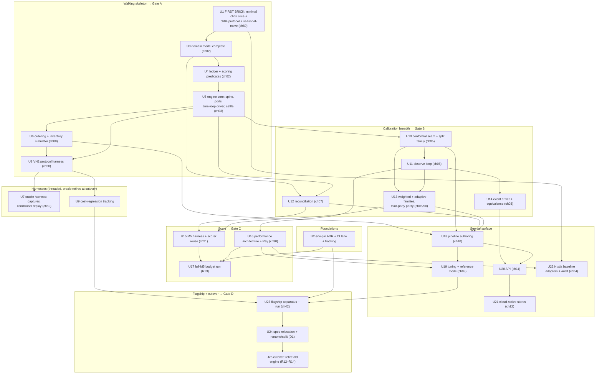

# feat: Stage 3 successor build plan — greenfield Calibre engine to spec, through cutover

---

## Goal Capsule

- **Objective.** Build the greenfield successor engine to the public
  architecture spec at `docs/spec/` — as an in-tree top-level package beside
  the frozen engine — prove it against the behavior oracle at tag
  `oracle-freeze-2026-07-06` under the chapter 50 doctrine, clear the
  cutover gate's R12–R13 authorization leg (Gate D-authorize) on the pinned
  x86_64 Linux environment, and execute the hard cutover that closes the
  gate with R14 — the old engine retires, the successor takes the `calibre`
  name, and the spec relocates with it.
- **Executable horizon.** The full build: twenty-five implementation units
  (U1–U25) across five build phases, four verification gates (A–D), ending
  at cutover. The first buildable unit is the chapter 60 first brick (the
  seasonal-naive forecasting adapter), so the contributor landing surface
  (R15) is real from day one.
- **Stop conditions.** (1) The abort checkpoint (Gate A) trips — the walking
  skeleton cannot run the VN2 protocol end-to-end with the conditional-replay
  checkpoint green within its budget (§ Abort/checkpoint criterion). (2) Any
  gate records a no-go the owner converts to a halt. (3) Owner halt at any
  time. In every stop branch the frozen engine remains the shipped system and
  the partial successor stays quarantined in its package — never half cut
  over.
- **Open blockers.** None. Stage 3 entry is fully cleared: the freeze and
  oracle pin landed (#283), the full-M5 profile landed (#289), the oracle
  contract is ratified (#290), the spec is landed and public (#297), the
  reader test passed (#292), and the entry decisions are ratified (#293).

---

## Product Contract

### Summary

Stage 3 replaces the current Calibre engine with a greenfield rewrite built
*to the spec, not to the code*. The spec (`docs/spec/`, chapters 00–90) is
the sole design source; the frozen engine is a **behavior oracle only**,
consulted at one immutable tag through manifest-complete captures, under a
tolerance doctrine that never compares floats across engines. The build walks
a skeleton first (domain → engine spine → first brick → ordering → VN2
protocol, with the oracle harness attached), then adds calibration breadth,
then M5 scale and the 15-minute performance budget, then the service surface,
then the flagship measurement — and finishes with a hard cutover: old engine
deleted, no shims, spec relocated into the successor.

### Problem Frame

Everything upstream of the build is done: the architecture is specified
publicly (#297), fidelity doctrine is ratified (#290 / chapter 50), the
oracle is frozen and pinned (#283), the performance baseline is measured
(#289 / chapter 30), the spec passed a context-free reader test by having a
stranger build the first brick from three chapters (#292), and the entry
decisions are ratified (#293). What does not exist is the successor itself,
nor the dependency-ordered, checkpoint-gated plan for building it. This
document is that plan — the #294 (U12) deliverable: implementation units
grounded in the spec's chapter contracts with requirement-ID citations, the
oracle and protocol harnesses as first-class units, a concrete mid-build
abort criterion for a weeks-scale bet, the R12–R14 cutover gate, and Paul's
landing surface.

### Key Decisions (ratified at Stage 3 entry — #293; restated here as their public build-plan record)

- **D1 — Repo strategy: in-tree sibling package, hard rename/repo-split at
  cutover.** The successor is a top-level package beside the current one for
  the whole build: the oracle is one `git show oracle-freeze-2026-07-06:path`
  away, the current CI and its x86_64 VN2 gate keep guarding the freeze, and
  one issue tracker serves the program. At cutover the successor takes the
  `calibre` name (hard rename or repo split — owner selects the variant at
  Gate D-authorize, § Outstanding Questions), and the spec relocates INTO the successor
  package at the split: the onboarding surface must not stay canonical in a
  retired repo. The relocation/rename step is an explicit late unit (U24).
- **D2 — No #279 baseline mint.** The ca-subset coverage-neutrality baseline
  stays unminted. The sha256-pinned full-M5 baseline plus the chapter 50
  derived-tolerance doctrine suffice for the successor's M5 apparatus; the
  advisory neutrality gate keeps skipping until cutover deletes it.
- **D3 — Pinned environment: x86_64 Linux.** Every headline number (R13's
  budget, the flagship publication, tracking records) is minted on a named
  x86_64 Linux environment recorded as an (architecture, OS, lockfile
  sha256) triple — satisfying `[VN2-N2]`'s comparability triple. R13 is
  measured there and nowhere else. Recorded as a spec ADR (U2).
- **D4 — Flagship run commits to the successor's public repo.** The
  publication artifact (certificate + price ratio + per-round trajectory +
  environment manifest) is committed under the successor package (U23) and
  travels with it through the split (U24).
- **C1 — The chapter 42 revisit checkpoint is a named pre-freeze
  obligation.** Before the flagship certificate is frozen, a discriminating
  measurement — an evaluation window containing stockouts, or a
  censoring-indicated dataset — must be run (on windows with no stockouts,
  demand-scored and sales-scored coverage coincide by construction, so the
  scored-series honesty is undiscriminated). The acceptance band is
  pre-registered per `[FLG-3]`: interval type and confidence stated in a
  recorded pre-registration at the run's declared coverage-event count —
  this plan pre-commits the apparatus to a Wilson score interval at 95%
  confidence computed at the actual post-warmup event count (owner confirms
  the pair at pre-registration time; § Outstanding Questions). U23 carries
  both obligations as blocking steps, not publication footnotes.

### Program bindings

Standing public-record facts this plan builds under; this plan is the first
durable public record for the ratified entry decisions above.

- **Freeze ruling.** Old-engine feature development is stopped for the
  program's duration. Reference-maintenance carve-outs only (config-level,
  no engine code path), each recorded with a frozen-CI tripwire re-run —
  including mechanical-rot fixes (runner images, action pins).
- **Oracle pin.** Tag `oracle-freeze-2026-07-06` (commit `686a1b2`),
  `uv.lock` sha256 `5cc585d3…43f3` — verified in-repo 2026-07-08. Oracle
  consultation happens at this tag only, never a branch head.
- **VN2 tripwire.** The frozen engine's 4992.20 regression gate stays green
  for the program's duration as freeze apparatus — never a successor
  target, never a comparison baseline (`[VN2-N1]`); deleted at cutover.
- **Leak review.** Every landing touching `docs/spec/` carries the owner
  leak-review stamp on its tracking issue before it lands, batched per
  landing.
- **This plan's landing.** One leak-review batch on #294 covers the plan
  document and the chapter 50 amendment (the reference-gate tier split)
  drafted with it; the landing closes #294. U2 mints the Stage 3 milestone
  and unit issues; the owner may backfill #293 with the Key Decisions
  wording above for issue-local traceability.

### Requirements

Program-level R-IDs, carried from the rewrite program (R11–R15; R12–R14 are
the hard cutover gate). Spec requirement tags (`[VIS-*]`, `[FRA-*]`,
`[CNF-*]`, `[PRF-*]`, `[VN2-*]`, `[M5-*]`, `[SEAM-*]`, `[FLG-*]`, …) carry
the fine-grained detail; the units cite them directly so this plan never
restates spec content it would then have to keep in sync.

- **R11 — Greenfield to the spec; the current repo is a component-behavior
  reference, never a number oracle.** The successor is built greenfield to
  `docs/spec/`; no module is ported from old code. The frozen engine is consulted as a
  behavior oracle only, at tag `oracle-freeze-2026-07-06` (commit
  `686a1b2`, `uv.lock` sha256
  `5cc585d347195861d81760e16a675bd2a05b51777cf90c13d9af0ab05bb743f3`),
  through manifest-complete captures. Oracle properties are behavioral with
  **derived tolerances** — never float equality at any tolerance minted from
  same-engine behavior: the frozen engine's own measured cross-environment
  spread (~0.4% end-to-end — the 4992.20-vs-~5011.20 cross-architecture
  delta) is the class-6 noise floor, proving same-engine 0.01 tolerances do
  not transfer. Cross-engine checkpoints are **protocol-portable only**
  (actuals-reveal mapping, cost trajectory via conditional replay against an
  independently recomputed expectation, final scalar at the class-6 floor);
  engine-internal checkpoints (exact fit-history equality, row orders, byte
  layouts) do not port. The M5 coverage scorer is engine-independent and
  reused — the successor emits a compatible resolved ledger or an export
  adapter — and the frozen M5 baseline (sha256-pinned,
  `population_coverage` 0.90972) serves as a directional
  accounting-mechanics reference only, never an equivalence target.
  (Chapter 50; #290.)
- **R12 — Cutover gate, part 1 (capability + evidence).** The VN2 and M5
  protocols run end-to-end on the new engine (`[VN2-R1]`–`[VN2-R5]`;
  `[M5-A1]`–`[M5-A6]` with a PASS verdict under derived bands and the
  sales-coverage label `[M5-X1]`–`[M5-X5]`). Cost-regression tracking is
  live, tracking the successor's own minted totals; old-engine numbers
  appear as labeled reference points only — never assertions, never targets,
  never denominators (`[VN2-N1]`, `[VN2-N2]`). A flagship run is committed
  with the guarantee on at tau — chapter 42's two-axis metric: certificate
  gated inside its pre-registered band (`[FLG-1]`, `[FLG-3]`, `[FLG-4]`),
  price ratio tracked, never gated (`[FLG-2]`, `[FLG-5]`) — per D4, to the
  successor's public repo.
- **R13 — Cutover gate, part 2 (performance).** A full-M5 backtest completes
  in ≤ 15 minutes wall clock on the pinned environment (`[PRF-1]`), with the
  chapter 30 companions: pre-origin overhead ≤ 60 s (`[PRF-2]`), within
  32 GB (`[PRF-20]`), and the standard profile deliverables emitted by the
  same harness invocation (`[PRF-3]`, `[PRF-30]`–`[PRF-33]`). Measured on
  the D3 environment, recorded with its (arch, OS, lockfile) triple.
- **R14 — Cutover gate, part 3 (hard cutover).** The old engine retires
  outright: deleted, not deprecated — no shims, no compatibility layers, no
  version-gated branches. Oracle gates (tier 3) are deleted with the oracle,
  never loosened; frozen-engine apparatus (the 4992.20 tripwire, sha-pinned
  baselines, config pins) is deleted; captures are archived as historical
  artifacts. The successor takes the `calibre` name and the spec relocates
  with it (D1, U24).
- **R15 — Paul's landing surface.** The chapter 60 first brick (the
  seasonal-naive adapter) is this plan's first buildable unit, so the
  contributor path is real from day one: the 00 → 02 → 04 reading order, a
  hand-checkable first runnable test, and a first-brick backlog of
  spec-sufficient, seam-free work items minted once Gate A passes
  (§ Paul's landing surface).

### Scope Boundaries

**In scope.** The successor engine to spec (chapters 02–12), its five-tier
test estate (chapter 50), the VN2 and M5 protocol harnesses (chapters 20,
21), the oracle harness, the performance architecture and budget run
(chapter 30), the flagship apparatus and run (chapter 42), cost-regression
tracking, the spec relocation/rename, and cutover.

**Deferred to follow-up work.**

- Production infrastructure provisioning (real clusters, Helm, managed
  Postgres/object stores). Chapter 12's conformance surface — store
  implementations, migration discipline, restart invariants, health/metrics
  — is in scope; standing up production environments is post-cutover work.
- First-brick backlog execution: the backlog is minted at Gate A (R15);
  individual bricks are contributor work items, not units of this plan.
- A censoring-indicated dataset binding beyond VN2/M5 (`[M5-X5]` names the
  revisit condition). The C1 discriminating measurement (U23) is in scope;
  a standing additional protocol chapter is not.
- Old-repo demo/documentation retargeting beyond what U24/U25 rewrite.

**Non-goals.**

- Bug-for-bug fidelity with the frozen engine — chapter 50 refuses it; the
  harness *expects divergence* on ruled-defect surfaces (the demand-vs-sales
  scoring instance), and cross-engine agreement there fails the test.
- Porting frozen-engine code, constants, tolerances, or baselines. The only
  carry path is the ruled oracle-property corpus behind
  `[ANNEX:50-oracle-curation-record]`, restated behaviorally.
- Old-engine feature work of any kind (the freeze ruling; #279 stays parked
  per D2).
- New headline claims beyond the chapter 42 flagship (chapter 01's flagship
  discipline; the spec-wide no-positioning rule).

### Dependencies / Assumptions

- **Oracle integrity (verified 2026-07-08).** Tag `oracle-freeze-2026-07-06`
  exists and resolves to `686a1b2…ddc3`; `uv.lock` at the tag hashes to the
  pinned sha256 above. A second freeze tag `m5-baseline-2026-06-25` pins the
  M5 baseline mint.
- **Packaging isolation is real.** The root project is hatchling keyed to
  the `calibre` package with no explicit packages list; both Dockerfiles
  `COPY calibre`; `ty` is invoked on `calibre/`; root pytest
  `testpaths=["tests"]`. A sibling package therefore does not leak into the
  frozen wheel, images, type gate, or test collection — and conversely needs
  its own project configuration (KTD-2).
- **Substrates.** Nixtla libraries (chapter 04's baseline adapter families)
  and Ray (chapter 03's distribution substrate) are available and
  lockable in the successor's own lockfile; the public VN2 and M5 datasets
  remain downloadable (never committed; per-file digests recorded per
  `[VN2-D0]`).
- **Program mechanics.** Single owner plus agent labor; the freeze ruling
  holds for the old engine (reference-maintenance carve-outs only); every
  landing touching `docs/spec/` carries the owner leak-review stamp on its
  tracking issue before it lands, batched per landing.
- **CI continuity.** The current CI (ubuntu x86_64; the always-on VN2
  4992.20 tripwire in `tests/benchmarks/test_vn2_regression.py`) stays green
  for the program's duration, guarding the freeze — it is frozen-engine
  apparatus and is deleted at cutover, never inherited by the successor.

### Outstanding Questions

1. **R-ID register — resolved 2026-07-08.** R11–R15 above carry the
   program-level register's wording (R12–R15 verbatim; R11's
   component-behavior-reference framing); the confirmation is recorded on
   #294. Kept here so the numbering question never reopens.
2. **Cutover variant under D1.** Hard in-place rename (successor takes over
   this repository; history, issues, and stars preserved; old engine deleted)
   versus repo split (fresh public `calibre` repo seeded from the successor
   package; this repo archived). Both satisfy D1 and D4; the plan defaults to
   the in-place hard rename for tracker continuity and executes either at
   U24 on the owner's Gate D-authorize selection.  USER hard in place rename
3. **Pre-registration pair for the certificate band (C1).** This plan
   pre-commits Wilson at 95% at the run's declared post-warmup event count;
   `[FLG-3]` requires the owner to fix interval type and confidence in the
   recorded pre-registration before any certified run. Confirm or amend at
   U23 step 1.
4. **Abort budget constants.** Gate A's six-week window and the two-week
   per-unit stall tripwire (§ Abort/checkpoint criterion) are proposed
   values; the owner ratifies them when U2 mints the tracking milestone.
5. **Working package name.** `newcalibre` (also the sibling draft's choice,
   matching the spec's "New-Calibre" phrasing) — confirm before U1 lands;
   the name disappears at U24 anyway. USER ok

### Sources

- **Spec (build target):** `docs/spec/00-overview.md` (map, prefix registry,
  vision matrix, reading order); `01-vision-and-commitments.md` ([VIS-1..11]
  register); `02-domain-model.md`; `03-engine-core.md`;
  `04-forecasting-plugins.md`; `05-conformal-plugins.md`;
  `06-online-recalibration.md`; `07-reconciliation.md`;
  `08-ordering-and-cost.md`; `09-tuning.md`; `10-pipeline-authoring.md`;
  `11-api.md`; `12-cloud-native.md`; `20-protocol-vn2.md`;
  `21-protocol-m5.md`; `30-performance.md`; `40-gated-seams/`
  (README + 41 + 42); `50-test-and-oracle-strategy.md`; `60-onboarding.md`;
  `90-annex-registry.md`; `adr/README.md`.
- **Oracle:** tag `oracle-freeze-2026-07-06` = commit `686a1b2`, `uv.lock`
  sha256 `5cc585d3…43f3` (verified in-repo).
- **Program record:** #283 (U1 freeze/oracle/tracking), #289 (U7 full-M5
  profile; `benchmarks/m5/profile/MEMO.md` — note the memo landed one commit
  after the tag but profiles the tagged tree), #290 (U8 oracle contract),
  #292 (U10 reader test — first brick built context-free, 7/7 green, four
  spec-flexibility points flagged), #293 (U11 entry decisions), #294 (U12 —
  this plan), #297 (U9 spec landing), #279/#280 (neutrality gate context).
- **Frozen-engine surfaces consulted as provenance only:** root
  `pyproject.toml` + `.github/workflows/ci.yml` (coexistence constraints),
  `tests/benchmarks/test_vn2_regression.py` (the gate-bites witness pattern
  chapter 50 carries; its pinned scalars retired),
  `calibre/evaluation/m5_coverage.py` + `tests/baselines/m5/baseline-manifest.json`
  (the engine-independent scorer and pinned baseline R11 names),
  `benchmarks/m5/profile/` (chapter 30's raw source).
- **Sibling draft:** the independent first draft of this plan file,
  superseded in place on branch `docs/294-stage3-successor-build-plan`;
  the draft remains at commit `fffefc3` (§ Appendix).

---

## Planning Contract

### Key Technical Decisions

- **KTD-1 — In-tree sibling package now, hard rename/repo-split at cutover
  (D1).** Working layout: top-level `newcalibre/` beside `calibre/`. The
  build inherits the repo's CI infrastructure (same runners, same
  triggers) via successor-scoped jobs, while the frozen jobs — including the
  x86_64 VN2 tripwire — keep running untouched. Oracle consultation is
  in-tree: `git show oracle-freeze-2026-07-06:<path>` and detached worktrees
  of the tag. U24 executes the rename/split and relocates `docs/spec/` into
  the successor tree.
- **KTD-2 — The successor is its own uv project, not a workspace member.**
  Own `newcalibre/pyproject.toml` + `newcalibre/uv.lock`. The frozen root
  lockfile is pinned by the oracle tag and guarded by the tripwire;
  successor dependency churn must never touch it. This also sidesteps every
  root-tooling hardcode (hatchling package discovery, `ty check calibre/`,
  root pytest `testpaths`, Dockerfile `COPY calibre`). Two pre-authorized
  config-only carve-outs on frozen surfaces, executed once in U2 with a
  recorded tripwire re-run: path-filter the frozen workflow away from
  `newcalibre/**`, and exclude `newcalibre/` from root ruff (root lint runs
  `ruff check .`).
- **KTD-3 — Oracle at the pinned tag, manifest-complete, tier-3-only.**
  Only tier 3 ever touches frozen-engine outputs. Every capture ships the
  chapter 50 manifest (tag, platform triple, lockfile digest, config digest,
  input-data digests); the capture runner recomputes the lockfile sha256
  from the environment it actually synced and hard-fails on mismatch. No
  capture is ever taken from a branch head.
- **KTD-4 — Derived tolerances everywhere; conditional replay is the
  designated cross-engine mechanism.** Every carried property names exactly
  one chapter 50 tolerance class with its derivation in-source; no default
  epsilon exists. Cross-engine end-to-end checking is conditional replay:
  the frozen engine's VN2 decision stream, replayed through the successor's
  settlement, compared against a trajectory **independently recomputed from
  the shared inputs** through the chapter 20 cost identities (class 2 —
  summation rounding), never against the frozen engine's stored ledger.
  Unconditioned cross-engine totals are never compared tighter than the
  class-6 ~0.4% floor, and then only as sanity, never equivalence.
- **KTD-5 — Walking skeleton first; the abort criterion sits on it.** The
  spine (domain → ledger → engine core → first brick → ordering → VN2 →
  oracle harness) is built before any breadth, because (a) the weeks-scale
  bet needs its earliest end-to-end signal, and (b) settlement arithmetic is
  where a greenfield engine silently diverges — conditional replay de-risks
  it at Gate A rather than at cutover.
- **KTD-6 — Environment pin as a spec ADR (D3).** `docs/spec/adr/0001`
  records the x86_64 Linux reference environment (hardware class, OS,
  Python minor, BLAS provenance, thread policy) and binds `[PRF-1]` to it.
  Chapter 30's provisional environment note is replaced by a pointer to the
  ADR. All headline numbers are minted there; nothing model-mediated is ever
  compared across environments.
- **KTD-7 — M5 scoring: own scorer permanent, frozen scorer as parity
  cross-check (R11).** The successor implements chapter 21's acceptance
  scorer (tier 4, permanent, bands re-derived per run). During the build it
  additionally exports a resolved ledger compatible with the frozen
  engine-independent scorer (columns `unique_id`, `h`, `model_name`, `y`,
  `lo_0p9`/`hi_0p9`; consumed by `score-m5-coverage`) — or ships an export
  adapter — and cross-checks the two scorers on the same ledger. Agreement
  certifies **accounting mechanics only** (chapter 50: a sales-resolved
  ledger can never certify coverage honesty); the sha-pinned frozen baseline
  (`population_coverage` 0.90972) is a directional class-5 reference. The
  cross-check retires with the oracle at cutover.
- **KTD-8 — Completion gates with an abort-to-frozen-engine posture.**
  Four gates (A–D, § Verification Contract), each a recorded go/no-go on the
  tracking issue. Gate A additionally carries the calendar-budgeted abort
  criterion. In every no-go branch the frozen engine keeps serving and the
  successor stays quarantined; an abort triggers a recorded owner
  disposition (re-scope, re-spec with a named re-entry precondition, or
  abandon), never an indefinite silent freeze. A recurring owner heartbeat
  (roughly every four weeks, non-gating) records phase progress and elapsed
  freeze cost on the tracking issue; a gate stalled without a credible path
  forward always triggers the review rather than silent drift.
- **KTD-9 — Conformance-first testing.** Each unit's test scenarios are the
  owning chapter's conformance items plus the #290-carried oracle properties
  for that surface, written as failing tests before implementation. Every
  numeric gate ships its witness (the smallest meaningful drift must fail
  it) in the same tier; a gate merged without its witness fails review.
- **KTD-10 — Reader-test hardening folded in early (from #292).** The four
  flagged spec-flexibility points become named definition tasks, not
  blockers: (1) concrete timestamp type/frequency representation
  (dataset-declared per `[SER-2]`) — U3; (2) frame column literal names +
  the int-in-float policy — U1; (3) fit retention scope — U1; (4) a task's
  series-set enumeration — U3. Each lands as a documented definition in the
  successor's domain/protocol code; if any proves to need spec text, it
  routes as a leak-reviewed spec amendment rather than a silent local fix.

### High-Level Technical Design

The component architecture is the spec's (chapters 02–12); this plan owns
only the build order. The dependency graph below is derived from the spec's
chapter dependency graph — domain model → engine core → plugins →
reconciliation → ordering → tuning → authoring → API → cloud-native — with
the oracle and protocol harnesses threaded through it and the four gates
marked.



Two structural notes. First, **the harnesses are units, not afterthoughts**:
U7 (oracle) attaches to the skeleton at Gate A, U9 (tracking) opens its
series with the skeleton's first minted VN2 numbers, and both discipline
every later measurement. Second, **the tier estate is built with the code**:
tier markers (0–4) exist from U1; tier 1 (oracle properties on synthetic
fixtures, the permanent center of gravity) accumulates in every unit;
tier 2 (self-consistency templates) is minted in U5 and re-run at every
gate; tier 3 (cross-engine, oracle-consuming) enters at U7 — joined by U15's
frozen-scorer parity cross-check — and dies at cutover; tier 4 (protocol acceptance at scale, scheduled) hosts the VN2/M5
acceptance runs plus the rewrite's side of reference-implementation gates
and survives cutover — per the chapter 50 amendment drafted with this
plan's landing, which splits reference gates per engine (rewrite side
tier-4 permanent; frozen side tier-3, retired with the oracle).

### Output Structure

Expected shape of the successor package (scope declaration, not a
constraint; per-unit **Files** lists are authoritative):

```
newcalibre/
├── pyproject.toml            # own project, own lockfile (KTD-2)
├── uv.lock
├── README.md                 # points readers at docs/spec/
├── src/newcalibre/
│   ├── domain/               # ch 02 — panel, frame, task, hierarchy, cost, session, descriptor
│   ├── ledger/               # ch 02 — row lifecycle, predicate registry, attribution
│   ├── engine/               # ch 03 — spine, ports (+ in-memory impls), drivers, settle, dispatch
│   ├── forecasting/          # ch 04 — protocol, registry, adapters/
│   ├── conformal/            # ch 05 — runtime seam, state, manifests, methods/
│   ├── observe/              # ch 06 — resolution join, pending buffer, cycle transaction
│   ├── reconcile/            # ch 07 — protocol, registry, hierarchy index, summing, strategies
│   ├── ordering/             # ch 08 — config validation, policies, simulator, objective
│   ├── tuning/               # ch 09 — candidate, study, search space, resume
│   ├── authoring/            # ch 10 — schema, validator, resolved config, CLI verbs
│   ├── api/                  # ch 11 — routes, jobs, schemas
│   ├── storage/              # ch 12 — relational + object stores, migrations
│   ├── telemetry/            # ch 30 — stage timing, peak-RSS capture
│   └── protocols/            # ch 20/21 — vn2/ (incl. certificate), m5/ (incl. scorer, export)
├── benchmarks/               # vn2/ (flagship/), m5/, profile/, tracking/, results/
├── scripts/                  # dataset acquisition, capture_oracle_vn2.py
└── tests/
    ├── tier1/                # oracle properties on synthetic fixtures (permanent)
    ├── tier2/                # class-4 self-consistency templates (permanent)
    ├── tier3/                # captures, conditional replay, ruled divergence (deleted at cutover)
    ├── tier4/                # protocol acceptance at scale + reference parity (permanent)
    └── fixtures/
```

### Risks

- **The performance bet (highest risk).** Chapter 30's budget demands ~5×
  over the measured 74.7-minute baseline on workstation class, via named
  architectural levers (`[PRF-10]`–`[PRF-14]`: incremental actuals/ledger
  indexing ≈ 49% of baseline wall, staging reuse ≈ 11%, incremental fit
  ≈ 19%, vectorized calibration updates ≈ 11%, plus idle-core parallelism).
  Mitigations: the levers are engine-architecture from day one (U5 ports,
  U16), not a retrofit; Gate C is a hard gate whose no-go path is a named
  `[PRF-1x]` gap analysis routed to targeted work or an owner-ratified ADR
  amendment — never a silent bar move.
- **Cross-architecture float divergence.** The measured ~0.4% spread poisons
  naive numeric comparison across engines and machines. Structural
  mitigations: the tolerance doctrine (KTD-4), manifest-complete captures
  (KTD-3), one pinned environment for every headline number (KTD-6).
- **Spec defects discovered while building.** The spec is authoritative; a
  discovered defect routes to a tracking issue and a leak-reviewed spec
  amendment — the build never silently diverges from a chapter. The #292
  reader test already de-risked chapters 02/04/60; the four flagged
  flexibility points are scheduled as KTD-10 definition tasks.
- **Freeze erosion.** A long Stage 3 invites "one small old-engine change",
  and mechanical rot (runner-image migrations, action deprecations) can
  redden the frozen CI with zero repo changes. The freeze ruling and
  carve-out discipline govern: config-only maintenance edits are
  pre-authorized as reference-maintenance carve-outs, each recorded with a
  tripwire re-run.
- **Scorer-reuse coupling (KTD-7).** Running the frozen scorer requires the
  frozen environment; the cross-check therefore runs from a detached
  worktree of the oracle tag with its own `--frozen` sync — never by
  importing frozen code into the successor. If that friction grows, the
  export adapter plus the successor's own scorer carry the requirement, and
  the cross-check frequency drops to Gate C only.
- **Single-maintainer bandwidth.** The gates prevent silent drift; the
  first-brick backlog (R15) offloads adapter/method breadth to contributors
  after Gate A; unit sizing targets PR-scale landings.
- **Dataset drift.** VN2/M5 inputs are re-downloaded, never committed; every
  measurement records per-file digests (`[VN2-D0]`), so a drifted input
  breaks comparability loudly instead of masquerading as a regression (U9).

---

## Implementation Units

Working name `newcalibre/` (Outstanding Question 5); all paths repo-relative.
Units are PR-scale work orders; U2 mints them as issues on the Stage 3
milestone. Units within a phase may proceed in parallel once their
dependencies are met. Every unit's test scenarios implicitly include: the
owning chapter's conformance items, tolerance classes named per assertion
with in-source derivations, and a witness for every numeric gate (KTD-9).

| U-ID | Unit | Spec surface | Phase → gate | Depends on |
|---|---|---|---|---|
| U1 | First brick: scaffold + minimal domain slice + adapter protocol + seasonal-naive | ch60, ch02 (slice), ch04 (core) | Skeleton → A | — |
| U2 | Environment-pin ADR, successor CI lane, Stage 3 tracking | ch30, adr/, D3 | Foundations | — |
| U3 | Domain model, complete | ch02 | Skeleton → A | U1 |
| U4 | Ledger + scoring predicates | ch02 `[LED-*]` `[GRT-*]` | Skeleton → A | U3 |
| U5 | Engine core: spine, ports, time-loop driver, settle hook | ch03 | Skeleton → A | U3, U4 |
| U6 | Ordering policies + inventory simulation + realized-cost objective | ch08, `[SEAM-4]` | Skeleton → A | U3, U5 |
| U7 | Oracle harness: captures, conditional replay, ruled divergence | ch50 | Skeleton → A | U5, U6, U8 |
| U8 | VN2 protocol harness | ch20 | Skeleton → A | U1, U5, U6 |
| U9 | Cost-regression tracking | `[VN2-N1]`/`[VN2-N2]`, R12 | Harness (opens at A) | U8 |
| U10 | Conformal runtime seam + split-conformal family | ch05, ch41 | Calibration → B | U3, U4, U5 |
| U11 | Observe loop / online recalibration | ch06 | Calibration → B | U10 |
| U12 | Reconciliation stage | ch07, `[SEAM-2]`/`[SEAM-3]`, `[PRF-21]` | Calibration → B | U3, U5 |
| U13 | Weighted + sequential-adaptive families, third-party parity gate | ch05 `[CNF-24]`, ch50 class 3 | Calibration → B | U10, U11 |
| U14 | Event driver + two-driver equivalence | ch03 `[DRV-*]` | Calibration → B | U5, U10, U11 |
| U15 | M5 protocol harness + acceptance scorer + frozen-scorer parity | ch21 | Scale → C | U12, U13 |
| U16 | Performance architecture + Ray dispatch | ch30 `[PRF-10..14,22,23,30..33]` | Scale → C | U5, U10, U11 |
| U17 | Full-M5 budget run on the pinned environment | R13, ch30 acceptance | Scale → C | U2, U15, U16 |
| U18 | Pipeline authoring | ch10 | Surface | U3–U6, U10–U13 |
| U19 | Tuning + reference-tuning mode | ch09, `[TUN-24]` | Surface | U16, U18 |
| U20 | API surface | ch11 | Surface | U14, U18 |
| U21 | Cloud-native stores, migrations, health | ch12 | Surface | U5, U20 |
| U22 | Baseline Nixtla adapter set + substrate audit | ch04 `[REG-4]`, `[VIS-1]`/`[VIS-2]` | Surface | U1, U16 |
| U23 | Flagship apparatus + run (incl. C1 obligations) | ch42, ch20 `[VN2-R4/R5]` | Flagship → D | U2, U9, U19 |
| U24 | Spec relocation + hard rename/repo-split | D1 | Cutover → D | Gate D-authorize |
| U25 | Cutover: retire the old engine | R12–R14 | Cutover → D | U24 |

### U1. First brick: scaffold + minimal domain slice + adapter protocol + seasonal-naive adapter

- **Goal**: The chapter 60 first brick green from spec chapters alone, on a
  real successor package — R15's landing surface live from day one, and the
  spine's first vertical slice (frame → task → adapter → validated output).
- **Requirements**: R11, R15; ch02 `[FRA-1]`–`[FRA-3]`, `[TSK-2]`; ch04
  `[ADA-1]`–`[ADA-3]`, `[ADA-5]`, `[ADA-6]`, `[REG-1]`, `[SCO-2]`; ch60's
  acceptance walkthrough.
- **Dependencies**: none (first buildable unit).
- **Files**: `newcalibre/pyproject.toml`, `newcalibre/uv.lock`,
  `newcalibre/README.md` (points at `docs/spec/`),
  `newcalibre/src/newcalibre/domain/frame.py` (frame constants + validator,
  minimal), `newcalibre/src/newcalibre/domain/task.py` (minimal task),
  `newcalibre/src/newcalibre/forecasting/protocol.py`,
  `newcalibre/src/newcalibre/forecasting/registry.py`,
  `newcalibre/src/newcalibre/forecasting/adapters/seasonal_naive.py`,
  `newcalibre/tests/tier1/test_frame_schema.py`,
  `newcalibre/tests/tier1/test_seasonal_naive.py`.
- **Approach**: Own uv project (KTD-2), minimal dependencies (numpy, pandas,
  pyarrow, pydantic, pyyaml; Nixtla enters at U22, Ray at U16). Implement
  only what chapters 02+04 give the brick: the typed frame columns and
  all-or-nothing schema validation (`[FRA-3]`), the full row key
  (series key, origin, horizon step, model name) (`[FRA-1]`), a task whose
  history is strictly pre-origin (`[TSK-2]`), the adapter protocol
  (construct-from-config, `fit`/`predict`, lifecycle error on premature
  `predict` (`[ADA-6]`), loud failure on short/missing history
  (`[ADA-5]`/`[ADA-6]`), scope-blind (`[SCO-2]`)), an explicit-identifier
  registry (`[REG-1]`), and the seasonal-naive lookup (step *h* reads
  `origin − m + ((h − 1) mod m)`). Two KTD-10 definition tasks land here as
  documented decisions: **frame column literal names + int-in-float policy**
  (all value columns float64; integer inputs upcast at the validation
  boundary) and **fit retention scope** (fit retains exactly the per-series
  minimal state the lookup needs — stated on the protocol as the retention
  rule adapters document). Tier markers 0–4 declared in the successor's
  pytest config from this unit.
- **Test scenarios**: chapter 60's first test verbatim — an `m = 7` daily
  fixture where every expected value is read off the history by eye:
  predict output (a) passes the frame schema and (b) carries the
  season-lagged value at each step (class-1/2, hand-derivable); the
  lifecycle guard (`predict` before `fit` raises, never empty rows); short
  history (< one season) and missing looked-up period fail loudly at
  `predict`; registry: unknown backend rejected listing available backends,
  duplicate identifier rejected; determinism — same task + config → same
  bytes (`[ADA-2]`).
- **Verification**: `uv sync && uv run pytest` green inside `newcalibre/`;
  root `uv.lock` untouched; a review-checklist line records that the
  implementation consulted no old-repo path and no annex pointer (the ch60
  standalone-readability discipline).

### U2. Environment-pin ADR, successor CI lane, Stage 3 tracking

- **Goal**: D3 recorded as a spec ADR; the successor's CI lane live on the
  repo's CI; the Stage 3 milestone and unit issues minted.
- **Requirements**: D1 (CI reuse), D3; `[PRF-1]` binding; `[VN2-N2]`
  comparability triple; program mechanics (R15 backlog hosting).
- **Dependencies**: none (parallel with U1).
- **Files**: `docs/spec/adr/0001-reference-environment.md`,
  `docs/spec/adr/README.md` (index row), `docs/spec/30-performance.md`
  (provisional-environment note → pointer to the ADR),
  `.github/workflows/newcalibre-ci.yml` (or successor jobs in the existing
  workflow, path-filtered to `newcalibre/**`), plus the two KTD-2 carve-outs
  on frozen config (workflow path filter; root-ruff exclude).
- **Approach**: The ADR pins the x86_64 Linux reference environment —
  hardware class (cores/RAM), OS, Python minor, BLAS provenance, thread
  policy — and states the consequence: `[PRF-1]`'s 15-minute bar binds to
  this profile; the chapter 30 baseline (74.7 min) is directional context —
  measured on laptop-class hardware under a different OS, never a
  comparison surface; chapter 30 assesses the bar plausible on workstation
  class and leaves laptop-class feasibility unestablished, so the ADR
  resolves the hardware class explicitly. Successor CI: lint/format/type/pytest (tiers 0–2) per
  commit; tiers 3–4 scheduled/manual per chapter 50 cadence. Mint the Stage 3
  milestone with one issue per unit, each carrying its gate assignment.
  This landing edits `docs/spec/` → owner leak-review stamp on the tracking
  issue before it lands.
- **Test scenarios**: a successor-only PR triggers only successor jobs; a
  frozen-path PR still runs the frozen pipeline unchanged (tripwire re-run
  recorded for the carve-out landing); the successor lane fails on a seeded
  lint/type error (lane actually bites).
- **Verification**: ADR indexed; chapter 30 carries no pending environment
  decision; milestone populated; carve-out record on the tracking issue.

### U3. Domain model, complete

- **Goal**: All of chapter 02 as typed code — the ubiquitous language every
  later unit imports, hardened where the reader test found flexibility.
- **Requirements**: R11; ch02 `[SER-1]`–`[SER-2]`, `[PAN-1]`–`[PAN-4]`,
  `[FRA-4]`–`[FRA-5]`, `[TSK-1]`, `[TSK-3]`–`[TSK-4]`, `[HIE-1]`–`[HIE-3]`,
  `[INV-TEMPORAL]`, `[INV-COHERENCE]`, `[CST-1]`–`[CST-4]`,
  `[SES-1]`–`[SES-3]`, `[GRT-1]`–`[GRT-4]`; decision-time vocabulary (lead
  time, review period, protection window, inventory position).
- **Dependencies**: U1 (extends its minimal slice in place).
- **Files**: `newcalibre/src/newcalibre/domain/` (panel, series, hierarchy,
  cost, session, descriptor, calendar), extending U1's frame/task;
  `newcalibre/tests/tier1/test_domain_panel.py`,
  `newcalibre/tests/tier1/test_domain_hierarchy.py`,
  `newcalibre/tests/tier1/test_domain_cost.py`,
  `newcalibre/tests/tier1/test_domain_descriptor.py`.
- **Approach**: Panel ingestion validation (unique (series key, timestamp),
  numeric values, censoring facts as status + optional availability bound
  `[PAN-3]`); the fitted-values sidecar table (`[FRA-5]`); immutable
  serializable tasks with scope resolved at construction (`[TSK-1]`,
  `[TSK-4]`); the static aggregation lattice with label-based collision-free
  node identity and all-members-present coherence (`[HIE-*]`,
  `[INV-COHERENCE]`); the four-field cost structure with the critical-ratio
  domain rule (`[CST-1]`–`[CST-2]`) and the per-decision/per-period pair
  mapping deferred to U6 for normative force (`[CST-4]`); deterministic
  session identity as a pure function (`[SES-1]`); the guarantee descriptor
  as a closed vocabulary {type, level, scored series, window, scope}
  (`[GRT-1]`–`[GRT-4]`) — unregistered claims unrepresentable. Two KTD-10
  definition tasks land here: **concrete timestamp/frequency representation**
  (each dataset declares its calendar; the engine stores timestamps in one
  documented concrete type with the declared frequency validated per
  `[SER-2]`) and **task series-set enumeration** (a task carries an explicit,
  deterministically ordered series-key list, fixed at construction — the
  ordering `[DET-2]` will consume).
- **Test scenarios**: schema rejection per missing/mistyped column across
  panel/frame/sidecar; property test — no history timestamp ≥ origin ever
  reaches an adapter (`[INV-TEMPORAL]` at task construction); lattice
  node-count identity and exact member sums on a fixture; aggregate value
  undefined when any member missing; critical ratio rejected at domain
  boundary (denominator zero, level outside (0,1)); descriptor closed-
  vocabulary rejection; session-identity purity (same defining inputs →
  same identity; any field changed → different).
- **Verification**: tier 1 green; the #290-carried ingestion and
  frame-contract kernels covered; both KTD-10 definitions documented on the
  types they bind.

### U4. Ledger + scoring predicates

- **Goal**: The ledger as the single scoring surface: row lifecycle,
  one-shot monotone resolution, the per-descriptor scored-row predicate
  registry, denominator discipline, and total unscored attribution.
- **Requirements**: R11; ch02 `[LED-1]`–`[LED-8]`, `[ORD-1]`–`[ORD-3]`.
- **Dependencies**: U3.
- **Files**: `newcalibre/src/newcalibre/ledger/`,
  `newcalibre/tests/tier1/test_ledger_lifecycle.py`,
  `newcalibre/tests/tier1/test_ledger_predicates.py`.
- **Approach**: Rows enter pending at issue time with all forecast columns
  populated (`[LED-1]`); resolution sets a finite actual exactly once, never
  backward (`[LED-2]`); late/out-of-order actuals leave rows pending, never
  degrade them (`[LED-3]`). One shared predicate registry keyed by
  descriptor type (`[LED-8]`) is the *only* coverage code path — every
  metric surface (M5 scorer, flagship certificate, diagnostics) consumes it,
  none re-derives it. Scored ⇔ resolved AND both bounds finite (`[LED-4]`);
  coverage denominators use scored rows only, with unscored counts reported
  alongside (`[LED-5]`); warm-up defined via the calibration requirement
  (`[LED-6]`); every unscored row attributable from the ledger alone
  (`[LED-7]`). Orders: non-negative, uniquely keyed, immutable
  (`[ORD-1]`–`[ORD-3]`).
- **Test scenarios**: lifecycle property — second resolution attempt
  rejected, no column ever degrades; denominator discipline on a mixed
  fixture (pending + unscored + scored) with exact counts; attribution
  totality — in a completed synthetic run, every unscored row names its
  cause from ledger columns alone; predicate-registry uniqueness — a second
  coverage implementation is structurally impossible to register for the
  same descriptor type; order immutability and key uniqueness.
- **Verification**: tier 1 green; the #290 denominator-taxonomy kernels
  carried; predicate registry demonstrably the only coverage path (grep-level
  audit in review).

### U5. Engine core: spine, ports, time-loop driver, settle hook

- **Goal**: Chapter 03's runtime: the fixed six-phase per-origin cycle over
  six abstract ports, the time-loop driver, the settle hook, the determinism
  contract, and the class-4 self-consistency templates minted as tier 2.
- **Requirements**: R11; ch03 `[ENG-1]`–`[ENG-4]`, `[SPN-1]`–`[SPN-5]`,
  `[DRV-2]`, `[STA-1]`, `[STA-3]`, `[DET-1]`–`[DET-7]`,
  `[SET-1]`–`[SET-7]`.
- **Dependencies**: U3, U4.
- **Files**: `newcalibre/src/newcalibre/engine/` (spine, ports, timeloop,
  settle), in-memory port implementations under
  `newcalibre/src/newcalibre/engine/ports/memory.py`,
  `newcalibre/tests/tier1/test_spine.py`,
  `newcalibre/tests/tier1/test_settle.py`,
  `newcalibre/tests/tier2/test_selfconsistency.py`.
- **Approach**: Orchestration is I/O-free over six ports — panel source,
  actuals source, artifact store, calibration-state store, ledger sink,
  dispatch backend (`[ENG-3]`); the whole cycle runs on in-memory ports (the
  chapter's port-isolation acceptance). Phase order fixed: Resolve →
  Predict → Reconcile → Calibrate → Order → Commit, Resolve strictly before
  Predict so each origin's intervals reflect everything admissible at it
  (`[SPN-1]`); unconfigured stages are identities (`[ENG-4]`); state mutates
  and persists exactly once per origin at Commit (`[SPN-4]`); committed
  origins skip on resume (`[SPN-5]`). Settle hook: arrival law (order at t
  serves t+L first, `[SET-1]`), one settlement record per (series, period)
  with costs booked exactly once (`[SET-2]`–`[SET-3]`), stock-out transition
  rule as configuration, drain of L zero-order periods after the final
  decision origin with a construction-time failure when history cannot
  support it (`[SET-4]`), decision cadence every R-th origin (`[SET-7]`,
  default R = 1). Determinism: reproducible task ordering off U3's
  enumerated series sets (`[DET-2]`), batch-placement invariance
  (`[DET-3]`), schedule-order independence (`[DET-4]`), explicit thread
  budgets (`[DET-5]`), seeded randomness (`[DET-6]`), resume determinism
  (`[DET-7]`). The class-4 templates minted here run at every gate:
  resumed == uninterrupted, serialized == never-serialized,
  same seed == same bytes (distributed == sequential activates with U16's
  dispatch backend — recorded as pending, never claimed vacuously).
- **Test scenarios**: no-op composition — every stage identity → output
  equals input frames byte-for-byte; kill-after-origin-k resume — final
  ledger identical to uninterrupted, no re-booked (series, period); arrival
  law and exactly-once cost booking on a hand-built fixture; drain-guard
  construction failure names the shortfall; port isolation — a full cycle
  under a filesystem/network/database canary shows zero I/O; same-seed
  bitwise reproducibility on one platform; phase-failure error names phase
  and origin (`[SPN-3]`).
- **Verification**: tiers 1–2 green; deferred acceptance items explicitly
  recorded (two-driver equivalence → U14; dispatch invariance → U16;
  substrate audit → U22) — no silent coverage claims.

### U6. Ordering policies + inventory simulation + realized-cost objective

- **Goal**: Chapter 08's decision layer: config validation, the cost-pair
  mapping, three pure policy families on the order-up-to skeleton, the
  lost-sales inventory simulator realizing the settle contract, and realized
  cost as the exported per-candidate objective.
- **Requirements**: R11; ch08 `[CFG-1]`–`[CFG-6]`, `[POL-1]`–`[POL-14]`,
  `[SIM-1]`–`[SIM-6]`, `[OBJ-1]`–`[OBJ-8]`; ch41 `[SEAM-4]` (bound: cost
  attaches at decision nodes; no lattice-level aggregate cost functional).
- **Dependencies**: U3, U5.
- **Files**: `newcalibre/src/newcalibre/ordering/` (config, policies,
  simulator, objective), `newcalibre/tests/tier1/test_policies.py`,
  `newcalibre/tests/tier1/test_simulation.py`,
  `newcalibre/tests/tier1/test_objective.py`.
- **Approach**: Pre-execution validation: cost structure declared before
  execution (`[CFG-1]`), fractile = critical ratio exactly (`[CFG-2]`),
  coverage sync as one declared fact (`[CFG-3]`), protection-window coupling
  P = L + R with a task horizon H < P rejected up front (`[CFG-4]`), open-interval domain
  (`[CFG-5]`), the single sanctioned explicit-fractile override that voids
  the claim (`[CFG-6]`). Policies: pure, deterministic, refusal-not-
  degradation (`[POL-4]`, `[POL-6]`); order-up-to skeleton
  order = max(T − IP, 0) (`[POL-5]`); newsvendor CR quantile (`[POL-7]`),
  (R,S) per-step-sum and terminal window-bound paths discriminated by frame
  mode (`[POL-8]`–`[POL-10]`), (R,s,S) inclusive reorder gate (`[POL-11]`);
  integer units (`[POL-12]`); bounds consumed unmodified — any cap/floor
  beyond the skeleton is a clamp that voids the claim (`[POL-13]`,
  `[SEAM-8]` coupling via descriptors). Simulator: arrivals → sales =
  min(start, demand) → pipeline shift/commit, lost sales, per-period linear
  cost parts recomputable from (name, rate, quantity) (`[SIM-1]`–`[SIM-4]`),
  purity and refusal (`[SIM-5]`–`[SIM-6]`). Objective: settle-path realized
  cost as the exported default (`[OBJ-2]`–`[OBJ-4]`), +inf on degenerate
  candidates vs loud abort on engine faults (`[OBJ-5]`), demand-semantics
  binding (`[OBJ-6]`), pinned identity — cost components banned as search
  dimensions (`[OBJ-8]`).
- **Test scenarios**: newsvendor/order-up-to/(R,s,S) arithmetic on
  hand-derived fixtures (class 1/2 — the #290 ordering kernels, including
  refusal on unformable critical ratio); conservation across a multi-period
  fixture (start − sales = end, lost sales vanish); pipeline timing (order
  at t never serves t's demand); cost breakdown row-exactness with
  recomputable parts; per-decision vs per-period mapping identity under
  L and R on a fixture (`[CST-4]`/`[CFG-4]`); objective purity — same
  (candidate, data, seed) → same scalar; witness — one cost-rate quantum on
  one period moves the objective.
- **Verification**: tier 1 green; chapter 08 conformance covered; `[SEAM-4]`
  shape enforced (no aggregate-node cost path exists to call).

### U7. Oracle harness: captures, conditional replay, ruled divergence

- **Goal**: The cross-engine mechanism, exactly as chapter 50 designates it:
  manifest-complete captures from the frozen engine at the pinned tag, the
  tier-3 conditional-replay gate on protocol-portable checkpoints with
  derived tolerances, and the expected-divergence check on the
  censoring-ruled surface.
- **Requirements**: R11; ch50 (capture manifest, checkpoint classification,
  conditional replay, tolerance classes 2/6, acceptance items 1–8, witness
  rule, the no-pre-change-baseline stop rule); KTD-3, KTD-4.
- **Dependencies**: U5, U6, U8 (replays through the successor's settlement
  against chapter 20 identities).
- **Files**: `newcalibre/scripts/capture_oracle_vn2.py` (capture runner),
  `newcalibre/tests/tier3/captures/vn2/` (decision stream +
  `manifest.json`), `newcalibre/tests/tier3/captures/censoring/`
  (synthetic censored-demand fixture capture + manifest),
  `newcalibre/tests/tier3/test_conditional_replay.py`,
  `newcalibre/tests/tier3/test_ruled_divergence.py`,
  `newcalibre/tests/tier3/conftest.py` (visible-skip-when-absent gating).
- **Approach**: The capture runner materializes a detached worktree of
  `oracle-freeze-2026-07-06`, syncs `--frozen` into its own venv, recomputes
  the lockfile sha256 from the file it actually synced and hard-fails on
  mismatch with the pin, runs the frozen VN2 winning-loop configuration, and
  writes the decision stream (599 series × 6 rounds of committed orders)
  plus the chapter 50 manifest: tag, platform triple, lockfile digest,
  config digest, input-data digests. The replay test verifies input digests
  against the manifest, feeds the captured stream plus revealed actuals to
  the *successor's* settlement, and compares against a trajectory
  **independently recomputed from the same shared inputs** through the
  chapter 20 cost identities — tolerance class 2, summation rounding; the
  frozen engine's stored ledger is never the expectation. The
  ruled-divergence capture runs the frozen engine on a synthetic
  censored-demand fixture; the tier-3 test asserts the successor's
  demand-scored result *diverges* (chapter 50 acceptance 5 — agreement is
  grounds for suspicion). Engine-internal checkpoints (fit histories, row
  orders, byte layouts) are explicitly not built — the classification is
  documented in the harness README. The frozen engine's 4992.20 scalar is
  never asserted anywhere in the successor tree.
- **Test scenarios**: replay matches the recomputed trajectory to summation
  rounding per round and at the terminal scalar; witness — one order
  perturbed by one unit in one round fails the gate; manifest completeness —
  a capture missing any field is refused as oracle evidence; input
  integrity — digest mismatch refuses to run; ruled divergence — successor
  demand-scored ≠ frozen sales-scored on the censoring fixture, and
  agreement fails; absent captures → tier 3 skips visibly with cause, never
  green-washes.
- **Verification**: tier 3 green against committed captures on the D3
  environment; witnesses proven to bite; chapter 50 acceptance items 1, 4,
  5, 8 demonstrably satisfied on the skeleton.

### U8. VN2 protocol harness

- **Goal**: Chapter 20 as runnable configuration on the successor: reveal
  loading/validation, the two-slot pipeline dynamics, exact cost
  accounting, and the three replication outputs — the skeleton's end-to-end
  proof and the flagship's future measurement surface.
- **Requirements**: R11, R12; ch20 `[VN2-0]`, `[VN2-D0]`–`[VN2-D7]`,
  `[VN2-C1]`–`[VN2-C4]`, `[VN2-S1]`–`[VN2-S4]`, `[VN2-K1]`–`[VN2-K4]`,
  `[VN2-R1]`–`[VN2-R3]` (R4/R5 measurement extras activate with U23);
  `[VN2-N1]`–`[VN2-N2]`.
- **Dependencies**: U1, U5, U6.
- **Files**: `newcalibre/src/newcalibre/protocols/vn2/` (adapter, transition,
  accounting), `newcalibre/benchmarks/vn2/` (configs),
  `newcalibre/scripts/download_vn2_data.py` (successor-owned acquisition
  recording per-file digests), `newcalibre/tests/tier1/test_vn2_protocol.py`,
  `newcalibre/tests/tier4/test_vn2_acceptance.py`.
- **Approach**: Protocol as data (`[VN2-0]`): 6 rounds, lead time 2, review
  period 1, holding 0.20 / shortage 1.00 enter as configuration, implying
  CR = 5/6 (`[VN2-K3]`). Reveal validation rejects anything but
  exactly-one-appended-week-column (`[VN2-D2]`); missing revealed value ⇒
  zero sales (`[VN2-D3]`); initial state seeds the two-slot pipeline
  (`[VN2-D7]`). The weekly transition implements arrive → sell →
  shift-and-commit with lost sales (`[VN2-S1]`–`[VN2-S3]`); the 8-week
  horizon books 6 decision + 2 drain weeks (`[VN2-S4]`). The skeleton
  acceptance run orders from the point forecast via order-up-to with
  descriptor claim `none (not engine-calibrated)` — valid pre-calibration
  under `[VN2-R5]`'s conditionality; the certificate surface activates at
  U23. Data acquisition is successor-owned from day one so no tier depends
  on frozen `benchmarks/` tooling that cutover deletes.
- **Test scenarios**: reveal validation (wrong/duplicate/removed column
  rejected); hand-checkable weekly transition including the seeded rounds;
  arrival-law timing (round-r order arrives week r+2); no-future-leak
  property — round-r decision is a function of reveals 0..r−1 only
  (`[INV-TEMPORAL]` protocol instance, the #290 reveal-anchor kernel);
  cost-accounting identities row-exact — holding on end inventory only,
  shortage on missed sales only, triple equals ledger sums (`[VN2-K2]`,
  `[VN2-K4]`); constants-as-config (changing a rate changes results, no
  literal in code paths).
- **Verification**: tier 1 green; the full 8-week run on challenge data
  produces order stream, cost ledger, and final triple, row-exact (tier 4,
  scheduled); this run's artifacts feed U7's replay and U9's first record.

### U9. Cost-regression tracking

- **Goal**: R12's tracking leg live from the skeleton onward: run-over-run
  tracking of the successor's own minted totals, with frozen-engine numbers
  as labeled reference points only — never assertions.
- **Requirements**: R12; `[VN2-N1]`, `[VN2-N2]`, `[VN2-D0]`; ch42 price-axis
  tracked-not-gated discipline (consumed later by U23).
- **Dependencies**: U8 (first record).
- **Files**: `newcalibre/benchmarks/tracking/series.jsonl` (append-only),
  `newcalibre/benchmarks/tracking/README.md`,
  `newcalibre/tests/tier4/test_tracking_discipline.py`.
- **Approach**: Every measurement run appends one record: the totals it
  minted (VN2 triple; later the flagship ratio and full-M5 wall clock), the
  comparability triple (config digest, toolchain/lockfile, architecture+OS)
  per `[VN2-N2]`, and the input-file digest inventory per `[VN2-D0]`.
  Comparisons — and any regression alert — exist only between successor
  records with matching triple and matching input digests; a drifted input
  breaks comparability loudly. Frozen-engine numbers (the 4992.20 triple,
  the 74.7-minute profile) appear once, in the README, labeled with their
  environments and the sentence that they are reference points, never
  targets or denominators. No assertion anywhere consumes them.
- **Test scenarios**: discipline — a record missing any manifest field
  (including input digests) is rejected; a comparison across mismatched
  triples or digests refuses to produce a delta; witness — a synthetic cost
  jump on a matching triple flags; a grep-level test proves no frozen-engine
  total appears outside the labeled README block.
- **Verification**: tier 4 check green; record 1 (skeleton VN2 run) present
  by Gate A; records for the M5 budget run and flagship land with U17/U23.

### U10. Conformal runtime seam + split-conformal family

- **Goal**: Chapter 05's stable runtime interface with the first method
  family: three-verb lifecycle over per-partition state, manifests,
  descriptor issuance, config parity, clamp discipline — the seam every
  later method plugs into and the flagship's exchangeability-carrying
  branch.
- **Requirements**: R11; ch05 `[CNF-1]`–`[CNF-32]` (split family
  instantiates `[CNF-24]`'s first member); ch41 `[SEAM-1]`,
  `[SEAM-5]`–`[SEAM-9]` (bound statements carried here); ch02
  `[CAL-1]`–`[CAL-4]`; ch03 `[STA-2]`.
- **Dependencies**: U3, U4, U5.
- **Files**: `newcalibre/src/newcalibre/conformal/` (runtime, state,
  registry, manifest, `methods/split.py`),
  `newcalibre/tests/tier1/test_conformal_runtime.py`,
  `newcalibre/tests/tier1/test_split_conformal.py`,
  `newcalibre/tests/tier2/test_state_roundtrip.py`.
- **Approach**: One runtime seam (calibrate/apply/observe) and the registry
  are the engine's only imports from the conformal layer (`[CNF-1]`).
  Method registry: name → (manifest, config schema, factory) (`[CNF-23]`);
  manifests declare emission form and scope, assumption class, calibration
  requirement n_min, censoring policy, `joint_claim` ∈ {none,
  class-conditional} only (`[SEAM-6]`), and context consumption gated by
  `consumes-calibration-context` (`[SEAM-7]`). State keyed (session,
  partition) and nothing else (`[CAL-1]`), split by scope with injective
  partition labels (`[CNF-6]`–`[CNF-8]`), factory-only restoration
  (`[CNF-9]`), unconditionally round-trippable (`[CAL-2]`, `[STA-2]`).
  Every issued row stamped (method, form+scope, working level, partition
  label, state reference) (`[CNF-4]`) and every bound carries a populated
  descriptor (`[SEAM-1]`); pre-readiness rows issue non-finite bounds
  attributed warm-up (`[CNF-14]`–`[CNF-15]`, split readiness
  α > 1/(n+1)); clamps: none by default, named opt-ins, per-row binding
  records, claim rewritten to `none` on exactly the modified rows
  (`[CNF-19]`–`[CNF-22]`, `[SEAM-8]`); config parity machine-checked
  (`[CNF-16]`–`[CNF-18]`).
- **Test scenarios**: descriptor mandatory — a bound without one is
  unissuable, unregistered claim rejected; split-conformal quantile-rank
  arithmetic on hand fixtures (class 1/2, the #290 calibration kernels:
  readiness gating, window accounting, warm-up attribution); state
  round-trip — serialized == never-serialized bit-identity of subsequent
  bounds (class 4); clamp — binding clamp rewrites descriptor per-row and
  binding rate appears in diagnostics; registry rejects bad `joint_claim`
  and class-conditional without declared context; parity — a runtime field
  absent from the authoring schema fails the machine check.
- **Verification**: tiers 1–2 green; the shared protocol suite is
  parameterized to run against every registered method from here on.

### U11. Observe loop / online recalibration

- **Goal**: Chapter 06's runtime/state contract shared verbatim by both
  drivers: atomic submission, keyed resolution, aggregate completeness
  gating, exactly-once delivery in deterministic order, atomic persistence,
  restart safety.
- **Requirements**: R11; ch06 `[OBS-1]`–`[OBS-32]`; ch03 `[SET-5]`;
  `[VIS-10]` acceptance.
- **Dependencies**: U10.
- **Files**: `newcalibre/src/newcalibre/observe/`,
  `newcalibre/tests/tier1/test_observe.py`,
  `newcalibre/tests/tier2/test_observe_restart.py`.
- **Approach**: The observe cycle — accept → resolve → deliver → persist —
  with atomic submission validation (`[OBS-2]`), idempotent resubmission
  and conflict rejection (`[OBS-5]`), bottom-series-only submissions with
  derived-never-posted aggregates gated on completeness
  (`[OBS-7]`–`[OBS-9]`, `[INV-COHERENCE]`), the strict due rule (`[OBS-6]`),
  observe-before-issue and snapshot issuance (`[OBS-11]`–`[OBS-12]`),
  exactly-once delivery per row or per protection window with window-sum
  gating (`[OBS-17]`–`[OBS-18]`), canonical delivery order and chunk
  invariance (`[OBS-26]`–`[OBS-27]`), single atomic cycle transaction
  spanning state upsert + pending removals + history appends (`[OBS-22]`),
  bounded state (`[OBS-24]`), censoring facts riding submissions and
  reaching the calibrator (`[OBS-30]`–`[OBS-32]`).
- **Test scenarios**: in-order vs out-of-order actuals with interleaved
  restarts yield identical calibration state and ledgers (class 4 — the
  `[VIS-10]` acceptance); aggregate resolution fires exactly when the last
  member lands; conflicting resubmission rejected, identical one a no-op;
  double-observe configuration rejected at construction (`[SET-5]`);
  cold start emits attributed non-finite bounds then escapes NaN at
  readiness (`[OBS-15]`); chunk invariance — one cycle vs many consecutive
  cycles, identical state.
- **Verification**: tiers 1–2 green; the restart template joins the gate
  re-run set.

### U12. Reconciliation stage

- **Goal**: Chapter 07: the reconciler protocol, strategy registry, generic
  summing-matrix construction, sparse-first representation at retail scale,
  and the points-only output contract.
- **Requirements**: R11; ch07 `[REC-1]`–`[REC-24]`; ch41 `[SEAM-2]`,
  `[SEAM-3]` (bound statements carried here); `[PRF-21]`.
- **Dependencies**: U3, U5.
- **Files**: `newcalibre/src/newcalibre/reconcile/` (protocol, registry,
  hierarchy index, summing, strategies),
  `newcalibre/tests/tier1/test_reconcile.py`,
  `newcalibre/tests/tier1/test_summing_matrix.py`.
- **Approach**: Per-origin stage strictly between predict and calibrate,
  rewriting the point column only and rejecting frames already carrying
  interval/quantile columns (`[REC-1]`, `[REC-3]`, `[SEAM-2]`); fixed
  three-argument callable protocol with inspectable metadata (`[REC-6]`,
  `[REC-8]`); registry with normalized names and scale-rejection by name
  (`[REC-9]`–`[REC-10]`); generic summing matrix from the hierarchy index,
  sparse and dense behind one label-indexed interface, sparse the default at
  scale (dense ≈ 7.6 GiB at full M5 — `[PRF-21]`), representation selection
  as a producer seam (`[REC-11]`, `[REC-14]`–`[REC-15]`); O(metadata) memory
  preflight (`[REC-16]`); coherence r = S·r[:n_bottom] within an
  instance-derived tolerance (`[REC-12]`); residual-requiring strategies fed
  by the fitted-values sidecar through the reconciliation context
  (`[REC-5]`); convergence surfaced as a first-class signal (`[REC-21]`);
  idempotence (`[REC-22]`); strategy as an experimental knob — config-
  selectable, sweepable (`[REC-23]`, feeding `[M5-R1]`'s coverage-lever
  reporting duty). Seeded strategies: no-op, bottom-up, a structural-weights
  projection, and a MinT-family entry behind the same seam.
- **Test scenarios**: node-count identity and exact member sums on a fixture
  lattice; projection strategies vs the closed-form dense reference within a
  derived κ·eps bound (class 3 — the #290 reconciliation mathematics, the
  carried closed-form reference restated engine-independently);
  interval-column rejection; cross-section isolation (`[REC-2]`, errors
  carry the cross-section identity); idempotence on an already-coherent
  frame; sparse == dense within the derived tolerance on the same fixture;
  hierarchy validation — uncovered series key rejected (`[REC-18]`),
  duplicate node rows rejected (`[REC-19]`).
- **Verification**: tier 1 green; both representations agree; memory
  preflight is O(metadata) by construction (no eager expansion in the
  estimate path).

### U13. Weighted + sequential-adaptive families, third-party parity gate

- **Goal**: The remaining two day-one method families behind the U10 seam
  (`[CNF-24]`), plus the engine-independent reference-implementation gate
  anchoring the sequential-adaptive family to a published trace.
- **Requirements**: R11; ch05 `[CNF-13]`, `[CNF-24]`–`[CNF-25]`,
  `[CNF-29]`–`[CNF-31]`; ch50 tolerance class 3 (reference-implementation
  agreement at a pinned commit).
- **Dependencies**: U10, U11.
- **Files**: `newcalibre/src/newcalibre/conformal/methods/weighted.py`,
  `newcalibre/src/newcalibre/conformal/methods/sequential.py`,
  `newcalibre/tests/tier1/test_weighted.py`,
  `newcalibre/tests/tier1/test_sequential_adaptive.py`,
  `newcalibre/tests/tier4/reference/aci/` (pinned third-party trace +
  parity test — tier 4, permanent, per the amended chapter 50).
- **Approach**: Each family declares its assumption class (weighted with
  declared reweighting; sequential-adaptive with long-run-proportion
  currency) and readiness rule in its manifest; adding a method touches only
  the registry and its own module (`[CNF-25]`). The parity gate replays a
  published third-party implementation's trace at a pinned commit and
  requires step-level agreement within the reference's declared tolerance,
  with a first-divergence diagnostic naming step and quantity — the
  reference-gate pattern chapter 50 carries (its old-repo instance is
  provenance only). The trace lives under `newcalibre/` so nothing depends
  on frozen-tree artifacts. Tier ruling: chapter 50 originally tiered all
  reference-implementation gates into tier 3 (deleted with the oracle),
  which would have discarded a permanent correctness anchor whose oracle
  is a published third-party trace, not the frozen engine. The chapter is
  amended in the same landing as this plan (one leak-review batch):
  reference gates are per-engine — the rewrite's side is tier-4 permanent,
  carrying the reference's declared tolerance (class 3); the frozen
  engine's side is tier-3 triangulation evidence and retires with the
  oracle. U13 builds the rewrite-side gate in tier 4 accordingly.
- **Test scenarios**: weighted finite-sample correction on hand fixtures
  (class 1/2); sequential-adaptive step arithmetic on a synthetic stream;
  step-level parity with the published trace within its declared tolerance
  (class 3), first-divergence diagnostic fires on a seeded perturbation
  (witness); manifests declare assumptions/readiness/currency; the shared
  protocol suite (incl. state round-trip) green for both families.
- **Verification**: tiers 1 and 4 green; three `[CNF-24]` families
  registered; the flagship's guarantee-on branch (unweighted split) and its
  alternatives all speak the same seam.

### U14. Event driver + two-driver equivalence

- **Goal**: Chapter 03's second driver: the same closed verb surface driven
  by external events, out-of-order tolerant, observationally equivalent to
  the time-loop driver — the one-engine claim made testable.
- **Requirements**: R11; ch03 `[DRV-1]`–`[DRV-3]`; ch02 `[SES-3]`;
  `[VIS-9]` acceptance.
- **Dependencies**: U5, U10, U11.
- **Files**: `newcalibre/src/newcalibre/engine/event_driver.py`,
  `newcalibre/tests/tier2/test_driver_equivalence.py`.
- **Approach**: The event driver composes fit/predict/calibrate/order/
  observe/settle/commit exactly as the time-loop driver does (`[DRV-2]`,
  no HTTP — chapter 11 projects transport later); late/out-of-order actuals
  ride U11's pending buffer (`[DRV-3]`); the time-loop driver is the
  in-order special case of the same mechanism.
- **Test scenarios**: same session-defining inputs and resolved-actuals
  stream through both drivers → identical ledger rows and orders
  (`[DRV-1]`, class 4 — the `[VIS-9]` acceptance); session warmed by the
  time-loop driver and continued by the event driver, per registered method
  (`[SES-3]`); out-of-order delivery converges to the in-order result.
- **Verification**: tier 2 green across all registered method families.
  **Gate B rider — advisory flagship dry-run** (adopted from the sibling
  draft): once U13+U14 are green, run the chapter 42 guarantee-on
  configuration shape on VN2 (split family, coverage target at CR, no
  clamps) and record coverage-vs-band shape and a rough cost read on the
  tracking issue — explicitly labeled advisory, never certified
  (`[FLG-3]` binds certified runs only). This is the earliest reading on
  the headline claim, three phases before U23.

### U15. M5 protocol harness + acceptance scorer + frozen-scorer parity

- **Goal**: Chapter 21 as runnable configuration: the data contract, the
  marginal lattice at ~33.6k nodes, streaming-origin validation, acceptance
  scoring with derived bands and the sales-coverage label — plus R11's
  scorer-reuse leg (KTD-7).
- **Requirements**: R11, R12; ch21 `[M5-0]`, `[M5-D1]`–`[M5-D5]`,
  `[M5-H1]`–`[M5-H5]`, `[M5-B1]`–`[M5-B4]`, `[M5-A1]`–`[M5-A6]`,
  `[M5-X1]`–`[M5-X5]`, `[M5-R1]`, `[M5-N1]`–`[M5-N2]`.
- **Dependencies**: U12, U13.
- **Files**: `newcalibre/src/newcalibre/protocols/m5/` (adapter, lattice,
  scorer, export), `newcalibre/benchmarks/m5/` (configs),
  `newcalibre/scripts/download_m5_data.py`,
  `newcalibre/tests/tier1/test_m5_protocol.py`,
  `newcalibre/tests/tier1/test_m5_scorer.py`,
  `newcalibre/tests/tier4/test_m5_acceptance.py`,
  `newcalibre/tests/tier3/test_frozen_scorer_parity.py`.
- **Approach**: Loader validates the sales/calendar contract with positional
  day-label derivation and a contiguity guard (`[M5-D1]`–`[M5-D2]`), phase
  resolution (`[M5-D3]`), hierarchy facts from the five attribute columns
  (`[M5-H1]`); marginal lattice satisfying the node-count identity
  n_nodes = n_bottom + Σ distinct + 1 with level-recoverable labels
  (`[M5-H2]`–`[M5-H4]`); origin-window readiness inequality
  n_first + 2·(h−1) ≤ n_origins enforced at configuration validation,
  recomputed from the method's declared requirement — never the copied
  constants (`[M5-B3]`–`[M5-B4]`). The successor's own scorer (tier 4,
  permanent): population and per-level statistics over the shared U4
  predicate, bands re-derived from sampling variance at the run's actual
  scored-row counts (`[M5-A1]`–`[M5-A4]`), completeness floor (`[M5-A3]`),
  outliers diagnostic-only (`[M5-A5]`), machine-readable verdict where
  undetermined never passes (`[M5-A6]`), every figure carrying the
  sales-coverage label (`[M5-X2]`) and the declared reconciler + phase +
  method + partitioning (`[M5-R1]` — the coverage-lever reporting duty).
  **Frozen-scorer parity (tier 3, retired at cutover)**: an export adapter
  emits the frozen scorer's resolved-ledger schema (`unique_id`, `h`,
  `model_name`, `y`, `lo_0p9`/`hi_0p9`); the frozen `score-m5-coverage` runs
  from a detached oracle-tag worktree over the successor's exported ledger;
  its population/per-level numbers must agree with the successor scorer's on
  the same ledger (accounting-mechanics certification only — chapter 50's
  censoring ruling bars any honesty claim), and the sha-pinned frozen
  baseline (`population_coverage` 0.90972) is consulted as a directional
  class-5 reference recorded in the run report, never asserted.
- **Test scenarios**: data-contract validation (broken calendar contiguity,
  missing attribute, unknown phase rejected); lattice identity on the
  canonical counts (30,490 bottom → 33,563 nodes) and collision rejection;
  readiness-inequality rejection at validation with the method's own n_min;
  scorer: count-carrying quantities from the shared predicate, band
  derivation at three synthetic scales, verdict property tests
  (undetermined never passes; any criterion failure → non-pass,
  machine-readable); label enforcement — a figure without the
  sales-coverage label is a test failure; export adapter round-trip — the
  exported schema is exactly what the frozen scorer consumes; parity —
  frozen and successor scorers agree on a reduced fixture ledger.
- **Verification**: tier 1 green; a reduced-slice acceptance run produces
  summary + per-node table + report; parity check green on the D3
  environment.

### U16. Performance architecture + Ray dispatch

- **Goal**: Chapter 30's architectural requirements built into the engine —
  the levers that close the ~5× gap — plus Ray behind the dispatch port and
  the remaining determinism acceptance.
- **Requirements**: R11, R13 grounding; ch30 `[PRF-10]`–`[PRF-14]`,
  `[PRF-22]`–`[PRF-23]`, `[PRF-30]`–`[PRF-33]`; ch03 `[DET-3]`–`[DET-5]`;
  ch04 `[SCO-4]`–`[SCO-5]`, ch30's incremental-fit protocol shape
  (`[PRF-12]` extends U1's adapter protocol).
- **Dependencies**: U5, U10, U11.
- **Files**: `newcalibre/src/newcalibre/engine/` (indexing, staging,
  dispatch/ray), `newcalibre/src/newcalibre/forecasting/protocol.py`
  (declared `update` path), `newcalibre/src/newcalibre/conformal/state.py`
  (vectorized batch apply/observe),
  `newcalibre/src/newcalibre/telemetry/` (stage timing + peak-RSS capture),
  `newcalibre/tests/tier1/test_incremental_indexing.py`,
  `newcalibre/tests/tier2/test_dispatch_invariance.py`,
  `newcalibre/benchmarks/profile/` (deliverable schema + harness hooks).
- **Approach**: Each lever names the baseline cost it deletes: due-date
  indexing makes per-origin resolve/commit O(newly admissible + newly
  resolved) against the 49% resolve+commit share (`[PRF-10]`); task
  histories become views over one staged immutable panel against the ~11%
  staging share (`[PRF-11]`); adapters may declare `update` distinct from
  `fit` and the engine dispatches to it (`[PRF-12]`, against the 19% fit
  share); calibration state applies batch-wise across partitions
  (`[PRF-13]`, against the ~11% conformal share); Ray enters behind the U5
  dispatch port with parallelism only along `[INV-TEMPORAL]`/`[CAL-3]`-
  permitted axes and state-bearing sequences never reordered (`[PRF-14]`).
  Ledger I/O streams (`[PRF-22]`); stage wall time and peak RSS are
  engine-emitted telemetry reconciling ≥ 99% of wall (`[PRF-30]`–`[PRF-31]`,
  `[PRF-23]`); the scaling-curve runner covers ≥ 3 panel sizes (`[PRF-32]`);
  parallel-efficiency reporting activates with the dispatch backend
  (`[PRF-33]`).
- **Test scenarios**: resolve+commit flat-cost property across a growing
  synthetic ledger (chapter 30's acceptance shape at test scale); a
  trivial-model run shows near-zero per-origin fit cost via the update path;
  batch-placement invariance and serial == parallel ledger identity under
  the Ray backend (`[DET-3]`–`[DET-4]` — activating the
  distributed == sequential class-4 template); thread budgets honored
  (`[DET-5]`); profile artifact carries every `[PRF-30]`–`[PRF-32]` field
  and reconciles ≥ 99% of wall clock (witness: a hidden sleep in a stage
  breaks reconciliation).
- **Verification**: tiers 1–2 green including dispatch invariance; scaling
  curve produced at 1k/10k series on CI-class hardware; the pending
  class-4 template is now green and joins every later gate.

### U17. Full-M5 budget run on the pinned environment

- **Goal**: R13 demonstrated: the full-M5 workload inside the chapter 30
  budget on the D3 environment, with the standard profile deliverables
  emitted by the same harness invocation.
- **Requirements**: R13; `[PRF-1]`–`[PRF-3]`, `[PRF-20]`; chapter 30
  acceptance 1–4.
- **Dependencies**: U2 (the pin), U15, U16.
- **Files**: `newcalibre/benchmarks/m5/` (full config),
  `newcalibre/benchmarks/results/m5-budget/` (committed profile artifact +
  environment manifest), one U9 tracking record.
- **Approach**: Owner-executed on the ADR-pinned environment. One harness
  invocation produces the benchmark result and the profile artifact —
  never hand-assembled (`[PRF-3]`). A miss fails Gate C: the gap analysis
  names which `[PRF-1x]` lever under-delivered and routes to targeted
  engine work or an owner-ratified ADR amendment — never a silent bar move.
- **Test scenarios**: none beyond the run — the committed artifact is the
  evidence; a tier-4 check validates artifact completeness, the ≥ 99%
  wall-clock reconciliation, and the environment manifest against the ADR.
- **Verification**: wall ≤ 15 min (`[PRF-1]`), pre-origin ≤ 60 s
  (`[PRF-2]`), peak RSS ≤ 32 GB (`[PRF-20]`) on the pinned environment;
  artifact + manifest committed; tracking record appended.

### U18. Pipeline authoring

- **Goal**: Chapter 10: the declarative authoring surface mapping 1:1 onto
  domain objects, `validate` as a first-class verb, closed schemas, sane
  defaults, sweep/tuning composition — the "easy, clean, fast" vision
  element with its scripted acceptance.
- **Requirements**: R11; ch10 `[AUT-1]`–`[AUT-12]`, `[VAL-1]`–`[VAL-7]`,
  `[CMP-1]`–`[CMP-6]`; `[VIS-7]`.
- **Dependencies**: U3–U6, U10–U13 (their user-facing projection; the
  oracle harness U7 and tracking U9 have no authoring surface).
- **Files**: `newcalibre/src/newcalibre/authoring/` (schema, validator,
  resolved-config, CLI verbs), `newcalibre/tests/tier1/test_authoring.py`,
  `newcalibre/tests/tier1/test_validate.py`,
  `newcalibre/tests/tier1/test_authoring_parity.py`.
- **Approach**: One versioned, closed (unknown-key-rejecting) schema and one
  validator shared by CLI files, API payloads, and programmatic mappings
  (`[AUT-1]`–`[AUT-3]`); block-to-domain mapping 1:1 and total, plugin
  params validated by the plugin's own schema (`[AUT-5]`–`[AUT-6]`); absent
  block ⇒ identity stage (`[AUT-8]`, riding `[ENG-4]`); defaults defined
  once in the schema (`[AUT-9]`); single-owner cross-block inheritance
  (`[AUT-10]`); resolved config canonically serialized and persisted per run
  (`[AUT-11]`); two-tier `validate` (dataset-free, then dataset-bound)
  with no config-caused failure after execution begins (`[VAL-1]`–`[VAL-3]`)
  and cross-field couplings as schema obligations — protection-window
  arithmetic, coverage-level agreement, the M5 readiness inequality, the
  drain guard (`[VAL-4]`); machine-checked full config parity across every
  registered plugin (`[VAL-6]`, closing the loop with `[CNF-16]`–`[CNF-18]`);
  sweeps as config directories with fail-fast validation, tuning runs as
  config + search-space block (`[CMP-1]`–`[CMP-6]`).
- **Test scenarios**: unknown-key rejection at any depth including plugin
  blocks; automated parity test across all registered plugins; per-coupling
  validate-time rejection with key path + observed value + violated
  constraint (`[VAL-5]`); minimal three-block config runs; the chapter 10
  onboarding acceptance script — a new user authors and validates a
  runnable backtest from docs alone, under thirty minutes, no engine source
  consulted (`[VIS-7]`, scripted and kept green in CI).
- **Verification**: tier 1 green; onboarding script green in CI.

### U19. Tuning + reference-tuning mode

- **Goal**: Chapter 09: the three-channel candidate, realized cost as the
  symbolically bound default objective evaluated in-loop, local/global study
  scope, Ray fan-out with resume, the forbidden-dimension guard, and the
  labeled reference-tuning mode the flagship's denominator requires.
- **Requirements**: R11, R12 grounding; ch09 `[TUN-1]`–`[TUN-24]`;
  `[VIS-4]`, `[VIS-8]`; ch42 `[FLG-5]`.
- **Dependencies**: U16, U18.
- **Files**: `newcalibre/src/newcalibre/tuning/` (candidate, study,
  objective binding, search space, resume),
  `newcalibre/tests/tier1/test_tuning.py`,
  `newcalibre/tests/tier2/test_study_resume.py`.
- **Approach**: Immutable three-channel candidate reconstructible from
  recorded trial params (`[TUN-1]`–`[TUN-3]`); objective = "the chapter 08
  objective" bound symbolically, never a formula (`[TUN-5]`), accumulated
  incrementally per origin inside a real chapter 03 backtest
  (`[TUN-11]`–`[TUN-12]`); search-space validation rejects decision-bearing
  dimensions (cost fractile, critical ratio, policy-consumed coverage) and
  structural identity keys pre-execution (`[TUN-8]`–`[TUN-10]`, with
  `[OBJ-8]`); candidate failure completes at worst objective, engine faults
  abort loudly (`[TUN-13]`); trial-local calibration snapshots
  (`[TUN-14]`); local/global studies share one machinery (`[TUN-15]`–
  `[TUN-17]`); durable named studies with partial-completion resume and
  seeded samplers (`[TUN-20]`–`[TUN-21]`); reference-tuning mode as an
  explicitly labeled, off-by-default lane whose bounds carry claim `none` —
  never certified (`[TUN-24]`, the `[FLG-5]` denominator lane).
- **Test scenarios**: a small study ranks candidates by in-loop realized
  cost with no post-hoc scoring (`[VIS-4]` acceptance); forbidden-dimension
  rejection at construction (fractile, coverage, scope); scope flip is
  config-only and both scopes pass the same protocol tests (`[VIS-8]`);
  resume reproduces surviving trials byte-identically (class 4); replaying
  recorded params reproduces the best candidate (`[TUN-3]`, `[TUN-21]`);
  reference-mode bounds carry claim `none` and are refused by the
  certificate path (coupling test with U23's eligibility).
- **Verification**: tiers 1–2 green.

### U20. API surface

- **Goal**: Chapter 11: the lifecycle verbs as thin projections of engine
  operations, async job semantics, deterministic session identity, tenancy,
  trusted server-owned artifacts, what-if overrides.
- **Requirements**: R11; ch11 `[API-1]`–`[API-9]`, `[JOB-1]`–`[JOB-4]`;
  ch02 `[SES-1]`–`[SES-2]`; `[VIS-6]`.
- **Dependencies**: U14, U18.
- **Files**: `newcalibre/src/newcalibre/api/` (routes, jobs, schemas),
  `newcalibre/tests/tier1/test_api_projection.py`,
  `newcalibre/tests/tier2/test_api_driver_equivalence.py`.
- **Approach**: Every verb is decode → validate → resolve tenant → invoke
  engine → encode, composing only the closed verb surface (`[API-1]`,
  `[DRV-2]`); one-directional layering with no import path from the engine
  into the API (`[API-2]`); sync verbs complete in-request, async ones
  return pollable idempotent handles (`[API-3]`, `[JOB-1]`–`[JOB-4]`);
  session identity derived server-side as the chapter 02 pure function —
  chapter 02's session-purity conformance completes here (`[API-4]`);
  tenant-scoped state with no cross-tenant existence oracle (`[API-5]`);
  clients never supply model bytes or artifact URIs (`[API-6]`); data-plane
  URI schemes allowlisted (`[API-7]`); what-if override as a stateless merge
  (`[API-8]`); structured error classes (`[API-9]`).
- **Test scenarios**: per verb — an API call and a driver call with the same
  defining inputs address the same session and append identical ledger rows
  (`[VIS-6]` acceptance, class 4); job lifecycle submit → poll → result with
  failure surfacing and idempotent resubmission; cross-tenant addressing
  indistinguishable from absent state; out-of-allowlist data-plane URI
  rejected before engine work; what-if leaves durable state untouched;
  layering test — no API import in engine modules.
- **Verification**: tiers 1–2 green.

### U21. Cloud-native stores, migrations, health

- **Goal**: Chapter 12: the three durable state classes implemented behind
  U5's ports — relational run metadata + calibration state, object-store
  artifacts — with migration discipline, health/readiness/metrics, and the
  kill-any-time restart invariants.
- **Requirements**: R11; ch12 `[TOP-1]`–`[TOP-6]`, `[DUR-1]`–`[DUR-11]`,
  `[RST-1]`–`[RST-5]`, `[MIG-1]`–`[MIG-5]`, `[MON-1]`–`[MON-4]`; `[VIS-5]`.
- **Dependencies**: U5, U20.
- **Files**: `newcalibre/src/newcalibre/storage/` (relational store, object
  store, migrations), `newcalibre/tests/tier1/test_stores.py`,
  `newcalibre/tests/tier2/test_restart_invariants.py`.
- **Approach**: Store implementations of the six ports — the engine core
  never learns about Postgres or object stores; every durable fact in a
  store, never process memory (`[RST-1]`); atomic conditional upserts on
  natural keys, per-(session, partition) atomicity, write-after-success,
  pointer-after-blob ordering, write-once artifacts
  (`[DUR-4]`–`[DUR-9]`); idempotent job submission (`[DUR-3]`); one linear
  forward-only migration lineage with a CI model-vs-head parity diff and
  startup revision verification (`[MIG-1]`–`[MIG-5]`); liveness process-
  local, readiness gating on config + store + schema revision, Prometheus
  metrics, correlated structured logs (`[MON-1]`–`[MON-4]`).
- **Test scenarios**: kill any single process mid-run and restart — the run
  resumes and resolves an identical ledger (`[VIS-5]` acceptance, class 4);
  two-replica interleaved-trace equivalence (`[TOP-1]`); calibration-state
  round-trip bit-identity under the real backend (`[DUR-6]`); empty
  model-vs-migration-head diff in CI (`[MIG-2]`); stale-schema replica
  reports not-ready and takes no traffic (`[MIG-5]`, `[MON-2]`); concurrent
  same-key writers serialize without a lost update (`[DUR-4]`–`[DUR-5]`).
- **Verification**: tiers 1–2 green against a real Postgres service in CI
  (the service-container pattern the repo's CI already runs).

### U22. Baseline Nixtla adapter set + substrate audit

- **Goal**: Chapter 04's `[REG-4]` baseline families — classical-
  statistical, gradient-boosted ML, neural — wrapping the Nixtla libraries
  behind U1's protocol, plus the `[VIS-1]` substrate audit.
- **Requirements**: R11; ch04 `[REG-4]`, `[ADA-1]`–`[ADA-6]`,
  `[ART-1]`–`[ART-6]`, `[FIT-1]`–`[FIT-5]`, `[CEN-1]`–`[CEN-6]`,
  `[SCO-1]`–`[SCO-5]`; `[VIS-1]`, `[VIS-2]`; ch03's substrate acceptance.
- **Dependencies**: U1 (protocol), U16 (update-path extension, Ray fan-out).
- **Files**: `newcalibre/src/newcalibre/forecasting/adapters/statistical.py`,
  `…/adapters/ml.py`, `…/adapters/neural.py`,
  `newcalibre/tests/tier1/test_baseline_adapters.py`,
  `newcalibre/tests/tier1/test_substrate_audit.py`.
- **Approach**: One adapter class per family; model choice within a library
  is configuration (`[REG-4]`); artifacts persist via each library's native
  API behind `dump_state()/load_state()` with exact-hit content-hash caching
  (`[ART-1]`–`[ART-4]`); fitted-values sidecar opt-in at fit time
  (`[FIT-1]`–`[FIT-4]`); native quantiles with the point-from-quantile rule
  (`[ADA-4]`); censoring-aware fit as a declared capability altering the
  training target only (`[CEN-3]`–`[CEN-6]`); `update` declared where the
  library supports it (`[PRF-12]`); scope-blind, fanned out by the executor
  (`[SCO-2]`–`[SCO-4]`). The chapter 60 brick stays library-free by design —
  documented as the spec's own exception when the `[VIS-1]` audit scopes
  "every bundled forecasting plugin" to the Nixtla-wrapping baseline set.
- **Test scenarios**: shared adapter conformance suite green for every
  registered adapter (`[VIS-2]` acceptance); artifact round-trip restores
  predict behavior identically per family (`[ART-3]`); seeded determinism
  per family (`[ADA-2]`); capability validation rejects a config requesting
  an undeclared capability pre-execution (`[REG-3]`); substrate audit — the
  engine core reaches Ray only through the dispatch port and every baseline
  adapter imports only Nixtla interfaces (`[VIS-1]`, completing U16's
  dispatch half); native-quantiles + active hierarchy rejected at validation
  (`[REC-24]` coupling).
- **Verification**: tier 1 green; `[VIS-1]`/`[VIS-2]` demonstrable for the
  Gate D-authorize completeness walk.

### U23. Flagship apparatus + run

- **Goal**: Chapter 42 realized end-to-end: pre-registration, the
  guarantee-on configuration minted fresh, certificate computation with
  eligibility enforcement, the engine-fresh reference tuning, the C1
  discriminating measurement, and the two-axis publication committed per D4.
- **Requirements**: R12; ch42 `[FLG-1]`–`[FLG-5]` + conformance 1–3 + the
  revisit checkpoint; ch20 `[VN2-R4]`–`[VN2-R5]`; owner decision C1.
- **Dependencies**: U2 (environment), U9 (tracking), U19 (reference mode);
  Gate B and Gate C passed.
- **Files**: `newcalibre/src/newcalibre/protocols/vn2/certificate.py`,
  `newcalibre/benchmarks/vn2/flagship/` (pre-registration file,
  guarantee-on config, reference config, publication artifact),
  `newcalibre/tests/tier1/test_certificate.py`.
- **Approach**: Strictly ordered, with the two C1 obligations as blocking
  steps: **(1) Pre-registration** — commit the recorded pre-registration
  before any certified run: interval type and confidence (this plan
  pre-commits Wilson at 95%; owner confirms), the declared post-warmup
  pooling window, at the event count the run declares (599 series × the
  post-warmup rounds) (`[FLG-3]`). **(2) Guarantee-on configuration minted
  fresh** — coverage target = critical ratio (5/6) in every decision slot,
  no clamp on the decision bound, the unweighted split-conformal branch,
  runtime defaults guarantee-correct; no constant ported from any prior
  engine. **(3) Reference re-tuned engine-fresh** in `[TUN-24]` mode against
  the chapter 08 objective (`[FLG-5]`). **(4) The C1 discriminating
  measurement, before the certificate is frozen** — an evaluation window
  containing stockouts (or a censoring-indicated dataset): demand-scored and
  sales-scored coverage must be shown to *differ* on that window, proving
  the scored-series label carries information; a window without stockouts
  cannot discharge this. If the VN2 evaluation window itself contains no
  stockouts, the discriminating window may instead be a censoring-indicated
  slice of the protocol history (the in-stock table, `[VN2-D6]`) or the U7
  synthetic censored-demand fixture elevated to a named measurement —
  chapter 42 requires a discriminating window, not the flagship window
  itself. Recorded as a named pre-freeze checkpoint in the publication. **(5) Certified run + publication** — both configurations on
  the pinned environment through the same settle-path accounting;
  certificate (coverage events per (series, origin): realized demand sum
  over the protection window ≤ the consumed order-up-to bound, pooled over
  exactly the pre-registered window) + price ratio + full per-round
  trajectory published together (`[FLG-1]`–`[FLG-2]`); eligibility enforced
  in code (`[FLG-4]`: wrong claim/currency/level, non-demand-honest label,
  or any clamp → ineligible); tracking record appended (U9).
- **Test scenarios**: chapter 42 conformance 1 (certificate computation
  rejects wrong claim, wrong level, non-demand-honest label, clamped bounds
  — including U19's reference-mode bounds), 2 (pooled number over exactly
  the pre-registered window; trajectory published alongside), 3 (both totals
  from identical settle-path accounting differing only in configuration);
  witness — a clamped-bound run is refused certification; band arithmetic —
  Wilson interval recomputed independently at the declared event count
  matches the published band.
- **Verification**: publication artifact + environment manifest + named
  pre-registration committed; the C1 checkpoint discharged and recorded; a
  certificate inside its band satisfies R12's flagship leg — a miss is
  published as-is and Gate D-authorize records the no-go (the publication's gate is
  honesty; the cutover decision is the gate's).

### U24. Spec relocation + hard rename/repo-split

- **Goal**: D1's exit executed: the successor takes the `calibre` name, and
  the spec — the canonical onboarding surface — relocates into the
  successor's tree so it never stays canonical in a retired repo.
- **Requirements**: R14 (mechanics precondition), D1; leak-review discipline
  (this landing moves `docs/spec/`).
- **Dependencies**: Gate D-authorize recorded (R12 + R13 evidence
  assembled; the chapter 01 completeness walk green; owner ratification;
  Outstanding Question 2 resolved).
- **Files**: repository-wide — `newcalibre/` → `calibre` package name and
  root promotion (pyproject/lockfile to root); `docs/spec/` relocated into
  the successor's docs tree; `README.md`, `CLAUDE.md`/agent docs, issue
  templates re-pointed; under the split variant: the new public `calibre`
  repo seeded and this repo archived with a pointer.
- **Approach**: One owner-driven landing window, ordered: tag the
  pre-cutover state on `main` as the rollback anchor and record the revert
  criterion (a named post-merge defect class — broken CI, broken onboarding
  script — triggers a single revert to the anchor); announce a merge freeze
  for in-flight successor PRs with an import/path mapping note (the rename
  breaks contributor branches otherwise); execute the owner-selected D1
  variant (in-place hard rename, default; or repo split); relocate
  `docs/spec/` with the successor and rewrite the chapter 00 map's
  self-references plus the onboarding pointers (chapter 60 reading order
  must resolve in the successor's tree); re-point branch-protection required
  checks at the successor CI jobs in the same window (deleted required
  checks otherwise block every subsequent merge). Leak-review stamp on the
  tracking issue before landing.
- **Test scenarios**: post-rename CI green (tiers 0–2 + scheduled 4); the
  chapter 60 onboarding script passes under the new name and paths; no
  import of the old package name survives (grep-level check); the spec's
  internal cross-references resolve at the new location; under the split
  variant, the archived repo carries a canonical pointer to the successor.
- **Verification**: rename/split landed; spec canonical in the successor;
  rollback anchor + revert criterion recorded.

### U25. Cutover: retire the old engine

- **Goal**: R14 completed and the R12–R14 gate closed: the old engine and
  its apparatus deleted outright, oracle gates deleted with the oracle,
  captures archived — no shims, no compatibility layers.
- **Requirements**: R12, R13, R14 (the full cutover gate); ch50's
  retirement rules.
- **Dependencies**: U24.
- **Files**: deletions — the frozen `calibre/` package, its `tests/`
  (including `tests/benchmarks/test_vn2_regression.py` and
  `tests/baselines/m5/`), frozen `benchmarks/` apparatus, root frozen
  project files, frozen Dockerfiles/workflow jobs; archives — tier-3
  captures moved to a historical-artifacts location with their manifests, a
  pointer left at the flagship publication's pre-move path.
- **Approach**: Delete, never loosen (chapter 50's cutover rule): the
  4992.20 tripwire and every sha-pinned frozen baseline go; tier 3 is
  deleted with the oracle (the third-party parity gate survives in tier 4 per the
  amended chapter 50; only the frozen engine's tier-3 side retires); the oracle tag remains in git history as the
  permanent reference; captures become manifest-complete historical
  artifacts. Verify the no-shim condition mechanically: no compatibility
  import, alias, or version-gated branch referencing the old engine
  anywhere in the successor tree. Close the Stage 3 milestone with the gate
  record.
- **Test scenarios**: post-cutover CI green on tiers 0–2 and scheduled
  tier 4; a repo-wide check finds no assertion pinned to a frozen-engine
  measured number and no reference to a deleted frozen path; tier-1 suite
  passes on a clean checkout with the oracle and captures absent
  (chapter 50 acceptance 7); the onboarding script and the first brick's
  tests still green.
- **Verification**: R14 checklist recorded on the tracking issue; the
  successor is the repo's only engine; Gate D closed.

---

## Abort/checkpoint criterion

The weeks-scale bet is re-evaluated at a measurable mid-build checkpoint,
**Gate A (the walking-skeleton gate)**, defined as:

> **By six calendar weeks after U1's first landing, units U1–U8 are complete
> and all of the following are green on the D3 environment:**
> **(a)** the VN2 protocol runs end-to-end on the successor engine and
> produces all three replication artifacts row-exactly
> (`[VN2-R1]`–`[VN2-R3]`);
> **(b)** the conditional-replay checkpoint passes — the frozen engine's
> captured decision stream, replayed through the successor's settlement,
> matches the independently recomputed cost trajectory to summation rounding
> (chapter 50 acceptance 4), with its witness proven to bite;
> **(c)** the tier-1 suite for U1–U8 passes on a clean checkout without the
> oracle (chapter 50 acceptance 7), and the instantiable class-4 templates
> (same seed == same bytes; resumed == uninterrupted) pass;
> **(d)** the first brick is green from chapters 02+04 alone (R15 surface
> live).
>
> **If any of (a)–(d) is not green at six weeks, halt.** Successor work
> stops; the owner records a disposition on the tracking issue choosing
> between: re-scope (a named, bounded plan amendment and one extension of at
> most three weeks — usable once), re-spec (findings route to leak-reviewed
> spec amendments and Stage 3 re-enters through a new U12-class plan), or
> abandon (the frozen engine remains the shipped system; the successor
> package is retained quarantined or deleted, by recorded choice).

Two auxiliary tripwires, so the six-week signal cannot arrive silently:

- **Stall tripwire.** Any single unit in U1–U8 exceeding two calendar weeks
  wall-clock without a recorded blocker on its issue triggers an immediate
  owner review — before the gate date.
- **Perf tripwire (Gate C's advance warning).** U16's scaling curve at
  1k/10k series is extrapolated against the chapter 30 budget when it first
  lands; an extrapolation exceeding the budget by more than 2× triggers a
  pre-Gate-C owner review of the `[PRF-1x]` lever plan rather than waiting
  for the full-M5 run to fail. The tripwire may be fed earlier still by a
  wall-clock-only reduced-M5 probe on the Gate B stack — minutes reported,
  no coverage artifact minted or pinned (D2 stands).

Later gates (B, C, D) are completion gates with recorded go/no-go and the
same abort-to-frozen-engine posture (KTD-8), but only Gate A carries a
calendar budget: it is the point of maximum information gain per week, and
the skeleton either proves the spine or the bet should not continue on
momentum. The owner ratifies the six-week and two-week constants at U2
(Outstanding Question 4).

---

## Paul's landing surface (R15)

The landing surface is real from day one because U1 *is* the first brick.

- **Reading order (exactly three files first):** `docs/spec/00-overview.md`
  → `docs/spec/02-domain-model.md` → `docs/spec/04-forecasting-plugins.md`.
  Nothing on the first-contributor path touches `40-gated-seams/`, the
  annex, or the old repo — needing anything outside the three chapters is a
  spec defect to report, never a reader failure (chapter 60's rule, already
  validated by the #292 context-free reader: 7/7 tests green).
- **First runnable test:** chapter 60's hand-checkable fixture — with
  `m = 7` and a short daily panel, `predict` at step *h* returns the history
  value at `origin − m + ((h − 1) mod m)`, and the frame passes `[FRA-3]`
  schema validation. Concretely:
  `uv run pytest tests/tier1/test_seasonal_naive.py` inside `newcalibre/`.
  The natural second test is the lifecycle guard (`[ADA-6]`: `predict`
  before `fit` raises).
- **If Paul arrives before U1 lands**, U1 is his unit — the program pairs
  him on it and the spec's standalone-readability claim gets its second
  external data point. Otherwise he re-derives the brick as onboarding and
  takes backlog item B1.
- **First-brick backlog** (minted as tracked issues at Gate A; each names
  its chapters, declares "no gated seam", and discloses the pending U24
  rename so the repository-wide move surprises no one):
  - **B1 — second classical adapter** (window-average or drift-naive):
    chapters 02 + 04 only; same shape as the brick, one new registry entry
    (`[REG-4]`'s classical family, `[VIS-2]`'s zero-engine-diff claim
    exercised).
  - **B2 — CSV panel dataset adapter**: chapters 02 + 10; panel validation
    (`[PAN-*]`) against a documented file contract.
  - **B3 — a fourth conformal method behind the seam** (after U10 exists):
    chapter 05; registry + module only (`[CNF-25]`'s
    adding-a-method-touches-nothing-else claim exercised by an outsider).
  - **B4 — ledger attribution report**: chapter 02 `[LED-7]`; a diagnostic
    surface over unscored-cause counts.
  - **B5 — a policy variant** (after U6): chapter 08; a new pure policy on
    the order-up-to skeleton with hand-derivable fixtures.
- **Graduation path** (chapter 60's "after the first brick"): a second
  forecasting family reads more of chapter 04; the calibration surface adds
  chapter 05; the ordering surface adds chapter 08 plus chapter 02's
  decision vocabulary. The gated seams are deliberately last.

---

## Verification Contract

Gate rows are cumulative: every gate re-runs tiers 0–2 for everything built
so far, plus all previously green gates' criteria. Every gate is a recorded
go/no-go on the tracking issue with the KTD-8 abort posture. Gate D is
recorded twice: **D-authorize** (before U24 executes anything) and
**D-close** (after U25).

| Gate | After | Proves | Go criteria (all measurable) | On no-go |
|---|---|---|---|---|
| **A** (abort checkpoint) | U8 (+U7, U9 open) | The spine and settlement arithmetic are sound end-to-end; the bet is worth continuing | § Abort/checkpoint criterion (a)–(d), inside the six-week budget; first tracking record appended; first-brick backlog minted on go | Halt per the abort criterion: re-scope (once, ≤ 3 weeks) / re-spec / abandon |
| **B** (calibration) | U14 | The calibration stack honors the seam contract on one engine, two drivers | Chapter 05 protocol suite green for all three `[CNF-24]` families; every issued bound carries a descriptor (`[SEAM-1]`); observe-loop restart equality (class 4); two-driver equivalence (`[DRV-1]`, `[VIS-9]`); reconciliation reference agreement within derived bounds; third-party parity gate green; advisory flagship dry-run recorded (U14 rider) | Targeted rework inside the phase; stall tripwire governs pace; owner review if the dry-run shows a structurally miscalibrated guarantee-on shape |
| **C** (scale) | U17 | The performance architecture closes the ~5× gap at retail scale | Full-M5 ≤ 15 min / ≤ 60 s pre-origin / ≤ 32 GB on the pinned environment with harness-emitted deliverables (`[PRF-1]`–`[PRF-3]`, `[PRF-20]`, `[PRF-30]`–`[PRF-33]`); M5 acceptance PASS under derived bands + sales-coverage label; frozen-scorer parity green; resolve+commit flat across origins; distributed == sequential green | Named `[PRF-1x]` gap analysis → targeted engine work or owner-ratified ADR amendment; never a silent bar move |
| **D-authorize** (cutover go) | U23 | Cutover is authorized | **R12**: VN2 + M5 end-to-end ✓ (A, C); tracking live with ≥ 3 real records and old numbers reference-only ✓ (U9); flagship committed, certificate inside its pre-registered band, C1 checkpoint discharged ✓ (U23). **R13**: the Gate C budget row ✓ on the D3 environment. **Completeness**: the chapter 01 register walked row by row — every `[VIS-1]`–`[VIS-11]` acceptance demonstrated by test or scripted walkthrough. **Owner ratification**, including the D1 variant selection (Outstanding Question 2) | The frozen engine remains the shipped system; a certificate-band miss publishes honestly and routes to owner review (chapter 42's discipline: the price axis never gates, the certificate does) |
| **D-close** (cutover done) | U25 | R14 is executed | Rename/split + spec relocation landed (U24); old engine + apparatus deleted, tier 3 deleted, captures archived, no shims (U25); tier-1 green on a clean checkout with the oracle absent; onboarding script and first brick green under the new name | A named post-merge defect class triggers the single revert to U24's rollback anchor; otherwise fix forward — a no-go here never reopens the frozen engine |

Standing verification obligations (every unit, every gate):

- Every assertion names its chapter 50 tolerance class; non-exact tolerances
  carry their derivation in-source (chapter 50 acceptance 2).
- Every numeric gate ships its witness in the same tier; deleting the
  witness makes CI fail (chapter 50 acceptance 6).
- No assertion anywhere compares successor floats to frozen-engine outputs
  at any tolerance (chapter 50 acceptance 1); tier 3 is the only tier that
  touches frozen-engine outputs, only via manifest-complete captures at the
  pinned tag.
- Landings touching `docs/spec/` carry the owner leak-review stamp before
  merging, batched per landing.

---

## Definition of Done

Stage 3 is done when all of the following hold, each with its record:

1. **Cutover gate green and executed (R12–R14).** VN2 and M5 run end-to-end
   on the successor with their protocol artifacts (R12); cost-regression
   tracking is live with the successor's own minted series and old-engine
   numbers present only as labeled references (R12); the flagship two-axis
   publication is committed — certificate inside its pre-registered
   Wilson band with the C1 stockout-window checkpoint discharged before
   freezing, price ratio tracked never gated (R12, D4, C1); full-M5 ≤ 15
   minutes on the pinned x86_64 Linux environment with harness-emitted
   profile deliverables (R13, D3); the old engine is retired outright — no
   shims, oracle gates deleted with the oracle, captures archived — and the
   successor holds the `calibre` name with the spec relocated into its tree
   (R14, D1, U24–U25).
2. **Oracle harness built, exercised, and retired on schedule (R11).**
   Manifest-complete captures at `oracle-freeze-2026-07-06` only;
   conditional replay green with biting witnesses; the ruled-divergence
   check proves demand-honest scoring diverges from the frozen engine;
   derived tolerances throughout; no cross-engine float assertion ever
   existed; tier 3 deleted at cutover.
3. **Abort criterion honored.** Gate A's six-week checkpoint was passed —
   or tripped and its recorded disposition followed. The gate record
   (dates, criteria states, decision) exists on the tracking issue either
   way.
4. **Paul's landing surface delivered (R15).** The first brick was the
   first buildable unit and stayed green through cutover; the backlog
   (B1–B5) was minted at Gate A; the 00→02→04 path and the first runnable
   test survive the rename (verified by U24's onboarding-script check).
5. **Spec integrity.** Every spec edit along the way (U2's ADR, any
   defect-driven amendment, U24's relocation) carried its leak-review
   stamp; no annex content was ever inlined; the successor tree contains no
   private references.

---

## Appendix — relation to the sibling draft (branch `docs/294-stage3-successor-build-plan`)

An independent run without this session's program context produced the
first draft of this plan file from the public docs alone (superseded in
place by this version; the draft remains at commit `fffefc3` on the
landing branch). The two plans agree on the build's spine to a striking
degree — in-tree isolated `newcalibre/` uv project, walking-skeleton-first,
conditional replay at the first gate, the five-tier estate, perf-before-surface,
flagship-last, delete-not-loosen cutover — which is itself evidence the spec
determines the build order. This plan deliberately adopts from the draft:
the own-lockfile isolation argument (KTD-2), the capture-runner
sha-verification detail (U7), the advisory flagship dry-run (U14 rider), the
branch-protection re-pointing and rollback-anchor cutover mechanics (U24),
the freeze-erosion risk framing, the program-bindings block, the
output-structure tree, and the four-week owner heartbeat (KTD-8). Material divergences, all traceable to
the ratified entry decisions this session holds:

1. **D1 exit.** The draft keeps one repo forever and leaves the spec at
   `docs/spec/`; this plan carries the ratified hard rename/repo-split with
   spec relocation into the successor (U24) — the onboarding surface must
   not stay canonical in a retired repo.
2. **R-ID register.** The draft mints plan-local R1–R15 whose numbers
   collide with the program-level register (the draft's R12 is the first
   brick); this plan carries the program-level R11–R15 verbatim so the
   cutover gate reads exactly as the register numbers it. A reconciled
   plan must not renumber the cutover gate.
3. **C1 as a blocking obligation.** The draft carries chapter 42's revisit
   checkpoint as a declared open item in the publication; this plan makes
   the discriminating stockout-window measurement a blocking pre-freeze step
   with the Wilson/95% band pre-commitment (U23 step 4), per owner decision
   C1.
4. **M5 scorer reuse.** The draft builds only a successor scorer; this plan
   adds the ratified frozen-scorer parity cross-check via an export adapter
   (KTD-7, U15) — an accounting-mechanics oracle surface the curation ruling
   names, retired at cutover.
5. **Abort criterion.** The draft uses completion gates with no calendar
   budget; this plan adds the mandated measurable budget (six weeks to the
   skeleton, stall and perf tripwires) on top of the same gate structure.
6. **Tracking placement.** The draft lands tracking late (its U23); this
   plan opens the series at the skeleton (U9) so "tracking live" (R12) has
   history by cutover rather than three records minted in the final phase.
7. **Parity-gate tier.** Both documents initially placed the third-party
   reference gate in a permanently surviving tier while chapter 50 tiered
   all reference-implementation gates into tier 3, deleted with the
   oracle. Rather than silently re-tiering, this landing amends chapter 50
   itself (reference gates are per-engine: rewrite side tier-4 permanent,
   frozen side tier-3 retired); the draft should re-base its U13 on the
   amended table.

Reconciliation recommendation: treat this document as the U12 deliverable's
content and the draft as its strongest independent review; where the two
disagree outside the six points above, the differences are cosmetic and the
draft's phrasing may freely be merged in.
